# Provision Kubernetes Using the OCI Console

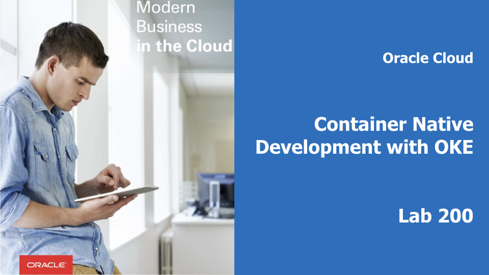

## Introduction

This is the second of several labs that are part of the **Oracle Public Cloud Container Native Development workshop.** This workshop will walk you through the process of moving an existing application into a containerized CI/CD pipeline and deploying it to a Kubernetes cluster in the Oracle Public Cloud.

You will take on 2 personas during the workshop. The **Lead Developer Persona** will be responsible for configuring the parts of the automated build and deploy process that involve details about the application itself. The **DevOps Engineer Persona** will configure the parts of the automation involving the Kubernetes infrastructure. To containerize and automate the building and deploying of this application you will make use of Wercker Pipelines for CI/CD, OCI Registry for a container registry, and OCI Container Engine for Kubernetes for provisioning a Kubernetes cluster on Oracle Cloud Infrastructure.

During this lab, you will take on the **DevOps Engineer Persona**. You will provision a Kubernetes cluster and all of the infrastructure that it requires using the OCI console. OCI will provision the Virtual Cloud Network, Load Balancers, Kubernetes Master and Worker instances, and etcd instance required to support your cluster.

**_To log issues_**, click here to go to the [GitHub oracle](https://github.com/oracle/learning-library/issues/new) repository issue submission form.

## Objectives

**Automate Deployment to Kubernetes**

- Create and Deploy to a Kubernetes Cluster
  - Set Up Oracle Cloud infrastructure
  - Provision Kubernetes Using the OCI Console
  - Configure and Run Wercker Deployment Pipelines
  - Deploy and Test the Product Catalog Application

## Required Artifacts

- The following lab requires:
  - an Oracle Cloud Trial Account

# Provision Kubernetes Using the OCI Console

## Set Up Oracle Cloud Infrastructure

### **STEP 1**: Log in to your OCI dashboard

- If you are using a Trial Account, **you must wait until you receive this email** indicating that your Cloud Account has been provisioned. _Please note that this email may arrive in your spam or promotions folder pending your email settings._

  

- Once you receive the **Get Started with Oracle Cloud** Email, make note of your **Username, Password and Cloud Account Name**.

  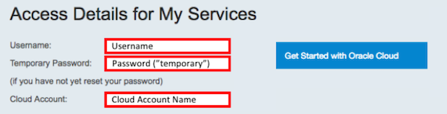

- From any browser go to:

    [https://cloud.oracle.com/en_US/sign-in](https://cloud.oracle.com/en_US/sign-in)

- Enter your **Cloud Account Name** in the input field and click the **My Services** button. If you have a trial account, this can be found in your welcome email. Otherwise, this will be supplied by your workshop instructor.

  

- Enter your **Username** and **Password** in the input fields and click **Sign In**. If you have a trial account, these can be found in your welcome email. Otherwise, these will be supplied by your workshop instructor.

  

**NOTE**: If you have used your trial account already, you may have been prompted to change the temporary password listed in the welcome email. In that case, enter the new password in the password field.

- In the top left corner of the dashboard, click the **hamburger menu**

  

- Click to expand the **Services** submenu, then click **Compute**

  

- On the OCI Console sign in page, enter the same **Username** as you did on the previous sign in page. If you are using a trial account and this is your first time logging into the OCI Console, enter the **temporary password** from your trial account welcome email. If you have already visited the OCI Console and changed your password, enter your **new password**. Otherwise, this password will be supplied by your workshop instructor.

  

### **STEP 2**: Create a Compartment for your Kubernetes nodes

Compartments are used to isolate resources within your OCI tenant. Role-based access policies can be applied to manage access to compute instances and other resources within a Compartment.

- Click the **hamburger icon** in the upper left corner to open the navigation menu. Under the **Identity** section of the menu, click **Compartments**

  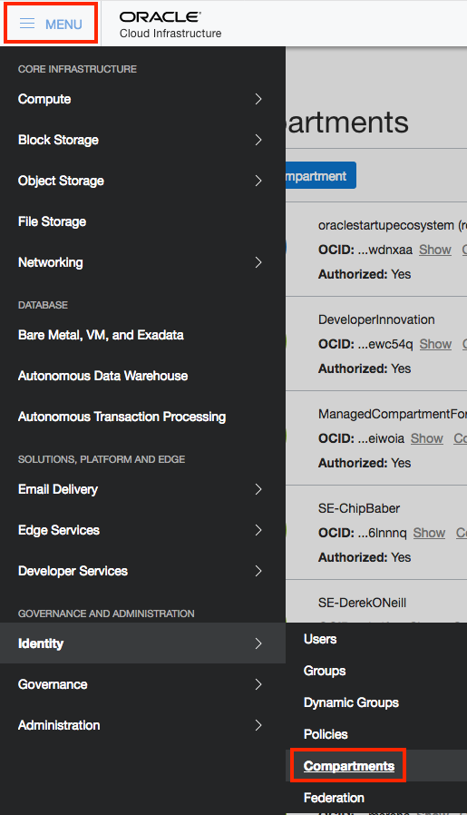

  - If you have a **Demo** compartment already, _**SKIP THIS STEP**_. Otherwise, Click **Create Compartment**

    

  - In the **Name** field, enter `Demo`. Enter a description of your choice. In the **Parent Compartment** field, ensure that the `root` compartment is selected (it will have the same name as your Oracle Cloud Account). Click **Create Compartment**.

    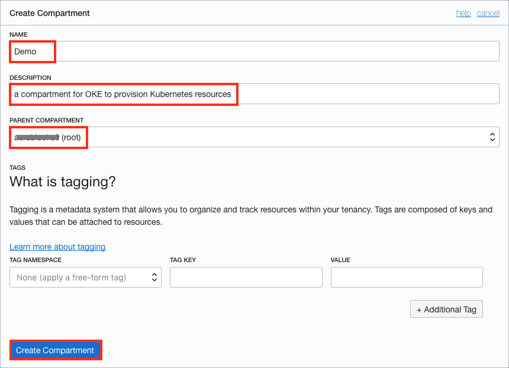

### **STEP 3**: Add a Policy Statement for OKE

  - Before the Oracle managed Kubernetes service can create compute instances in your OCI tenancy, we must explicitly give it permission to do so using a policy statement. From the OCI Console navigation menu, choose **Identity->Policies**.

    

  - In the Compartment drop down menu on the left side, choose the **root compartment**. It will have the same name as your OCI tenancy (Cloud Account Name).

    

  - Click **PSM-root-policy**

    

  - Click the **Add Policy Statement** button

    

  - In the Statement box, enter: `allow service OKE to manage all-resources in tenancy` and click **Add Statement**

    

### **STEP 4**: Provision Kubernetes Using the OCI Console

  - Now we're ready to create our Kubernetes cluster. From the OCI Console navigation menu, select **Developer Services->Container Clusters (OKE)**.

    

  - In the Compartments drop down, select the **Demo** compartment.

    

  - Click **Create Cluster**

    

  - We don't need to make any changes to the default values on this form, but let's look at what will be created when we submit it.

    
    

    - Starting at the top you'll notice that the cluster will be created in our **Demo** compartment.
    - We can customize the name of this cluster if we want
    - Multiple versions of Kubernetes are available, with the newest version selected by default
    - The default cluster creation mode will automatically create a Virtual Cloud Network for our cluster, including 2 load balancer subnets and 3 subnets for our worker VMs
    - We can customize the size and quantity of worker VMs in the node pool; by default we will get 3x 1 OCPU VMs, one in each Availability Domain.
    - We can also add more node pools to the cluster after creation.
    - The dashboard and Tiller will be installed by default.

  - Click **Create**. You will be brought to the cluster detail page. Your cluster will take a while to provision, so let's use this time to create a cloud VM that we can use to manage our cluster using the command line.

### **STEP 5**: Launch a Cloud Compute Instance for Cluster Management

  - Before we can launch a compute instance, we need two things: a Virtual Cloud Network to connect it to, and an SSH key pair to use for authentication. We could create a new VCN, but since the cluster wizard is already going to create one, we will just make use of that. So let's work on creating an SSH key pair for our instance. The method of generating an SSH key pair will depend on your operating system.

    **NOTE**: There are several files that will be downloaded or created on your local machine during this workshop. We recommend creating a directory to store them in for ease of locating and cleaning up. In this step, you will create a directory inside your home/user directory called `container-workshop`. You are free to change the location and name of this directory, but the lab guide will assume it is located at `~/container-workshop/`. **You will need to modify the given terminal commands throughout this lab** if you change the location or name of the directory.

    **Mac/Linux**:

      - Open a terminal or shell window and run the following commands:

        ```bash
        cd ~
        mkdir container-workshop && cd container-workshop && mkdir ssh-keys && cd ssh-keys
        ssh-keygen -f ./ssh-key -N ""
        ```
        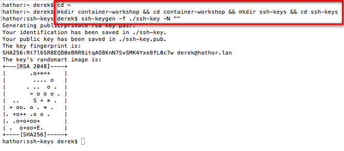

    **Windows**:

      - If you don't already have them, download PuTTY and PuTTYgen from [http://www.putty.org/](http://www.putty.org/)

        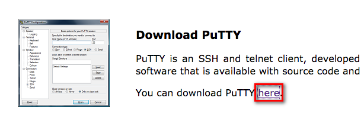
        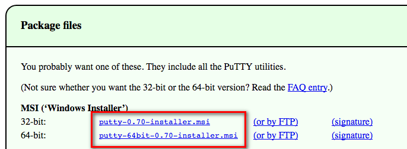

      - Locate and run **puttygen.exe** in the PuTTY install folder.

      - Ensure that **RSA** or **SSH-2 RSA** is selected in the `Type of key to generate` field (which one you see is dependent on your version of PuTTY)

      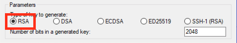

      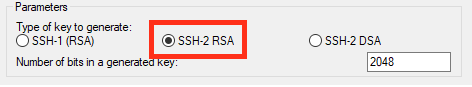

      - Click **Generate**

        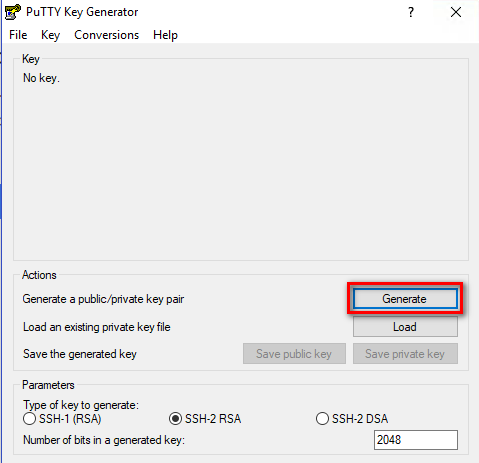

      - **Move your mouse around the blank area** as instructed to genereate random data.

        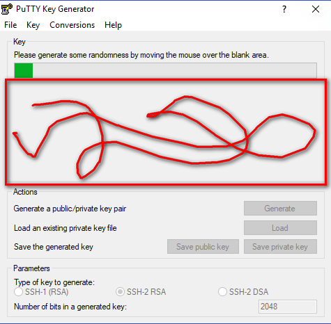

      - Click **Save private key** and then click **Yes** to continue saving without a passphrase.

        

        - In the save dialog box:
          - Navigate to your home directory/user folder (usually **C:\Users\\<username\>**).
          - Click **New Folder** and name the folder `container-workshop`.

            
          - **Double-click** the `container-workshop` folder to enter it.
          - Click **New Folder** again. This time name the folder `ssh-keys`.

            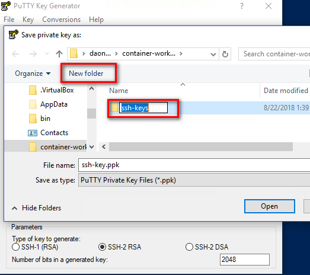
          - **Double click** on `ssh-keys` to enter that folder.
          - Finally, name the key **ssh-key.ppk** and click **Save**.

            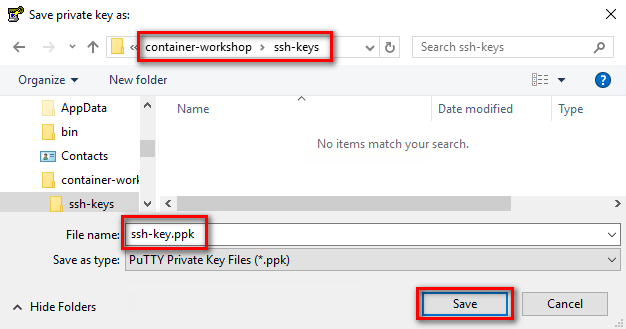

      - Select and copy the **public key** using Control-C, which is displayed in the `Public key for pasting into OpenSSH authorized_keys file` region. Paste it into a **new text file** using **notepad** and save the file in the `C:\Users\username\container-workshop\ssh-keys` folder.

        **NOTE**: Do not use the Save public key button, as it uses an incompatible key format.

        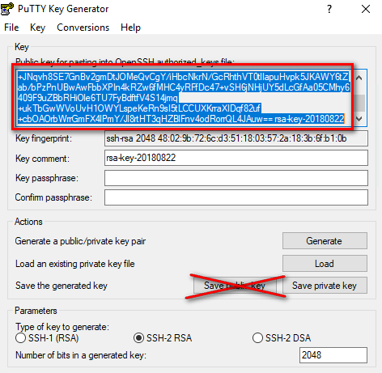
        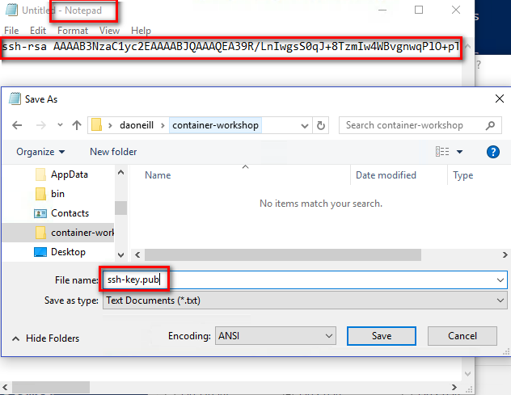

      - When you SSH to your instance in a later step, use PuTTY to connect instead of a command-line ssh session.

  - With the keys generated, we are ready to launch an instance. From the OCI Console navigation menu, select **Compute->Instances**. Ensure you are still working in the **Demo** compartment using the drop down list in the left pane.

    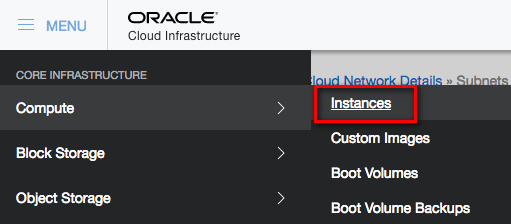

  - Click the **Create Instance** button.

    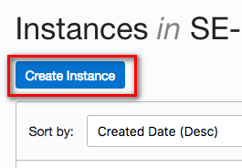

  - Leave the Availability Domain, Image Source, and Instance Type settings at the defaults.

    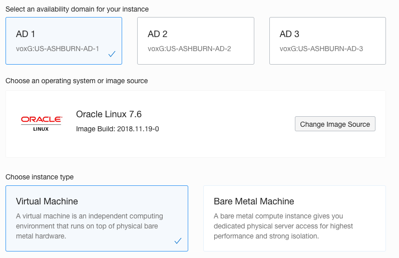

  - In the Instance Shape field, click **Change Shape**. We will use a 2-OCPU VM, since we are using all of our available 1-OCPU VMs for Kubernetes worker nodes.

    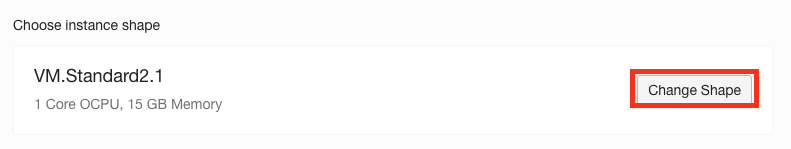

  - In the Browse All Shapes pane, check the box next to **VM.Standard2.2** and click **Select Shape**.

    

  - In the Add SSH Key area, click **Choose Files** and select the **ssh public key** you generated at the beginning of this step (e.g. `~/container-workshop/ssh-keys/ssh-key.pub`).

    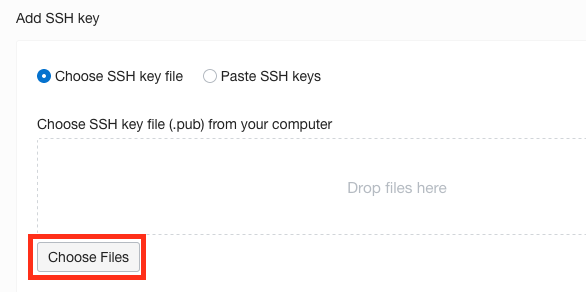

  - Make the following selections in the **Configure Networking** form:
    - In the VCN Compartment field, ensure **Demo** is selected.
    - In the VCN field, ensure **oke-vcn-quick-cluster1** is selected (if you changed the name of your cluster, the `cluster1` portion of these name will differ).
    - In the Subnet Compartment field, ensure **Demo** is selected.
    - In the Subnet field, select the subnet that begins with **oke-svclbsubnet-quick-cluster1**, which is in the **Public Subnets** section. Take care __not__ to select the subnet that begins with oke-subnet, as this one is a private subnet (not accessible from the internet).

    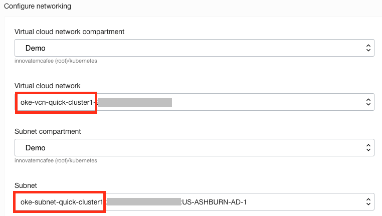

  - Click **Create**

    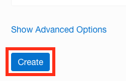

  - You will be brought to the instance details page. Wait for your instance to transition from the Provisioning state to the **Running** state before proceeding.

    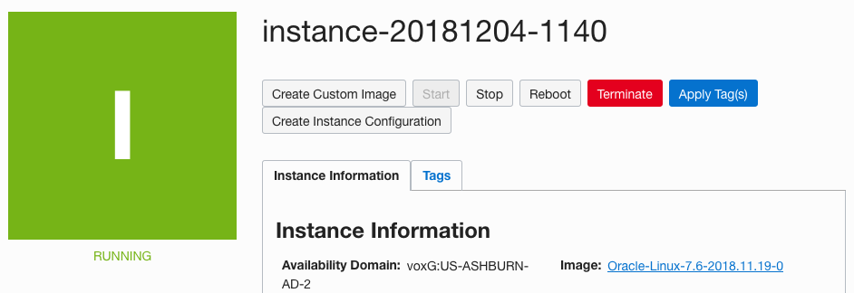

### **STEP 6**: Prepare OCI CLI for Cluster Access and Download kubeconfig

  - Your instance should now be in the **Running** state. Let's SSH into the instance and install the command line utility that will let us interact with our cluster. Still on the instance details page, find the **Public IP Address** and copy it to the clipboard.
    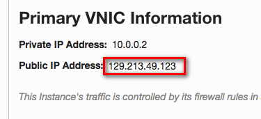

  - Open an SSH connection to the instance using the following OS-specific method:

    **Mac/Linux**
      - Open a terminal or shell window
      - Run the following commands, pasting in the **Public IP Address** from your clipboard in place of <Public IP Address>

        ```
        cd ~/container-workshop/ssh-keys/
        ssh -i ssh-key opc@<Public IP Address>
        ```
      - Type **yes** and **press enter** when asked if you want to continue connecting

        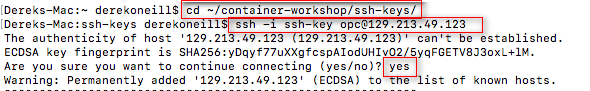

    **Windows**
      - Open PuTTY
      - In the Category pane, select Session and enter the following:
        - Host Name (or IP address): **opc@[Public IP Address you copied to the clipboard]**
        - Connection type: SSH
        - Port: 22
      - In the Category pane, expand Connection, expand SSH, and then click **Auth**. Click **Browse** and select your private key (for example, **C:\Users\\<username\>\container-workshop\ssh-keys\ssh-key.ppk**).
      - Click **Open** to start the session.

  - From _inside the SSH session_, run the following command to install the OCI CLI, which will allow you to interact with your cluster:

    `bash -c "$(curl -L https://raw.githubusercontent.com/oracle/oci-cli/master/scripts/install/install.sh)"`

    **CAUTION**: When copying the above command, be careful not to copy a newline character at the end. If you paste the command into your SSH session and it executes without you pressing enter, cancel the command with **Control-C**, then press the **up arrow** to retrieve it from the history, and press **enter** to run it without the newline character.

    

  - For each of the prompts, accept the default by **pressing enter**

    

  - When the install is finished, configure the OCI CLI by running `oci setup config` in your SSH session. In a web browser on your local machine, open your **User Settings** page: use the navigation menu to go to Identity->Users and select **View User Details** from the three-dots menu for your user. You will need some details from this page to complete the setup.

    

  - After initiating `oci setup config`, respond to the prompts as follows:
    - Enter a location for your config: **accept default by pressing enter**
    - Enter a user OCID: copy your OCID by clicking **Copy** in the **User Information** box in OCI Console
    - Enter a tenancy OCID: copy the **Tenancy OCID** from the tenancy details page (found under the administration section of the OCI navigation menu)

      

      

    - Enter a region: type the **region shown in the upper right** corner of OCI Console
    - Do you want to generate a new RSA key pair?: **Y**
    - Enter a directory for your keys to be created: **accept default by pressing enter**
    - Enter a name for your key: **accept default by pressing enter**
    - Enter a passphrase for your private key: **accept default by pressing enter**

    

  - You've just generated an RSA key pair that we will use to authenticate you to the OCI API. Click **back** to get back to the User Settings page in your browser, click **Add Public Key**

    

  - We need to copy and paste the public key into this box. In your _SSH session_, run the following command to output the public key:

    `cat /home/opc/.oci/oci_api_key_public.pem`

    

  - Select the entire key, beginning with: `-----BEGIN PUBLIC KEY-----` and ending with `-----END PUBLIC KEY-----`. **Copy it** and **paste it** into the Public Key text area in the OCI Console Add Public Key dialog. Then click **Add**.

    

  - You are now ready to download the `kubeconfig` file using the OCI CLI that you just installed. From the OCI Console navigation menu, select **Developer Services->Container Clusters (OKE)**, then click the name of your cluster, **cluster1**

    

    

  - Click **Access Kubeconfig**.

    

  - Two commands are displayed in the dialog box. **Copy and paste** each command (one at a time) into your _SSH session_ and run them. The first creates a directory to store the `kubeconfig` file, and the second invokes the OCI CLI to download and store the `kubeconfig` file on your client virtual machine. Then click **Close**.

    

    

    

    **NOTE**: Copy and paste the commands from the OCI Console window -- the second command below is personalized with your cluster OCID. They are listed here for reference only.

    >mkdir -p $HOME/.kube

    >oci ce cluster create-kubeconfig --cluster-id <your-kubernetes-cluster-ocid\> --file $HOME/.kube/config

  - Your `kubeconfig` file was downloaded from OCI and stored in ~/.kube/config. In your _SSH session_, **run** `cat ~/.kube/config` to output the contents of the file. **Copy** the contents and **paste** them into a new text file on your local machine. Name the file `kubeconfig` and **Save** the file to your **container-workshop directory** (e.g. `~/container-workshop/` or `C:\Users\<username>\container-workshop\`)

    **NOTE**: Save the `kubeconfig` file as a plain text file, not as a .docx, .rtf, .html, etc.

    

  - In order to interact with your cluster and view the dashboard, you will need to install the Kubernetes command line interface, `kubectl`. We will do that next.

### **STEP 7**: Install and Test kubectl on Your Local Machine

- The method you choose to install `kubectl` will depend on your operating system and any package managers that you may already use. The generic method of installation, downloading the binary file using `curl`, is given below (**run the appropriate command in a terminal or command prompt**). If you prefer to use a package manager such as apt-get, yum, homebrew, chocolatey, etc, please find the specific command in the [Kubernetes Documentation](https://kubernetes.io/docs/tasks/tools/install-kubectl/).


  **Windows**
    ```bash
    cd %USERPROFILE%\container-workshop
    curl -LO https://storage.googleapis.com/kubernetes-release/release/v1.11.2/bin/windows/amd64/kubectl.exe
    ```

  **Mac**
    ```bash
    cd ~/container-workshop
    curl -LO https://storage.googleapis.com/kubernetes-release/release/$(curl -s https://storage.googleapis.com/kubernetes-release/release/stable.txt)/bin/darwin/amd64/kubectl
    chmod +x ./kubectl
    ```

  **Linux**
    ```bash
    cd ~/container-workshop
    curl -LO https://storage.googleapis.com/kubernetes-release/release/$(curl -s https://storage.googleapis.com/kubernetes-release/release/stable.txt)/bin/linux/amd64/kubectl
    chmod +x ./kubectl
    ```

- In your terminal window or command prompt, run the following commands to verify that `kubectl` is able to communicate with your cluster. You should see `cluster-info` print out the URL of the Kubernetes Master node and `get nodes` print out the IP address and status of each of the worker nodes.

  **Windows**
    ```bash
    set KUBECONFIG=%USERPROFILE%\container-workshop\kubeconfig
    kubectl.exe cluster-info
    kubectl.exe get nodes
    ```

  **Mac/Linux**
    ```bash
    export KUBECONFIG=~/container-workshop/kubeconfig
    ./kubectl cluster-info
    ./kubectl get nodes
    ```

    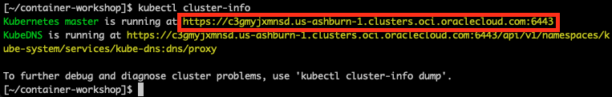

    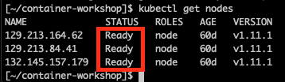

    **NOTE**: You should see in the `cluster-info` that the Kubernetes master has an `oraclecloud.com` URL. If it instead has a `localhost` URL, your `KUBECONFIG` environment variable may not be set correctly. Double check the environment variable against the path and filename of your `kubeconfig` file.

- Now that we have verified that `kubectl` is connected to our cluster, let's increase the default auto-logout time so that we don't have to keep re-authenticating during the workshop. Note that the default logout time of 15 minutes is set for security reasons. The `--token-ttl=43200"` argument in the following command is the only change that we are making to the dashboard.

  **NOTE**: The following commands are **optional**.

  **Windows**
  ```bash
  kubectl.exe patch deployment kubernetes-dashboard -n kube-system -p "{\"spec\": {\"template\": {\"spec\": {\"containers\": [{\"name\": \"kubernetes-dashboard\", \"args\": [\"--token-ttl=43200\", \"--auto-generate-certificates\"]}]}}}}"
  ```

  **Mac/Linux**
  ```bash
  ./kubectl patch deployment kubernetes-dashboard -n kube-system -p '{"spec": {"template": {"spec": {"containers": [{"name": "kubernetes-dashboard", "args": ["--token-ttl=43200", "--auto-generate-certificates"]}]}}}}'
  ```

  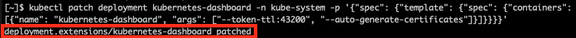

- Now that we've increased the session timeout, we can use `kubectl` to start a proxy that will give us access to the Kubernetes Dashboard through a web browser at a localhost URL. Run the following command in the same terminal window:

  **Windows**
    ```bash
    kubectl.exe proxy
    ```

  **Mac/Linux**
    ```bash
    ./kubectl proxy
    ```

  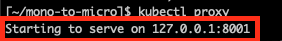

  **NOTE**: If you receive an error stating `bind: address already in use`, you may have another application running on port 8001. You can specify a different port for the proxy by passing the `--port=` parameter, for example `kubectl proxy --port=8002`. Note that you  will have to modify the URL for the dashboard in the next step to match this port.

- Leave the proxy server running and navigate to the [Kubernetes Dashboard by Right Clicking on this link](http://localhost:8001/api/v1/namespaces/kube-system/services/https:kubernetes-dashboard:/proxy/), and choosing **open in a new browser tab**.

- You are asked to authenticate to view the dashboard. Click **Choose kubeconfig file** and select your `kubeconfig` file from the folder `~/container-workshop/kubeconfig`. Click **Open**, then click **Sign In**.

  

- After authenticating, you are presented with the Kubernetes dashboard.

  

- Great! We've got Kubernetes installed and accessible -- now we're ready to get our microservice deployed to the cluster. The next step is to tell Wercker how and where we would like to deploy our application. In your **terminal window**, press **Control-C** to terminate `kubectl proxy`. We will need the terminal window to gather some cluster info in another step. We'll start the proxy again later.

## Configure and Run Wercker Deployment Pipelines

### **STEP 8**: Define Kubernetes Deployment Specification

- From a browser, navigate to your forked twitter-feed repository on GitHub. If you've closed the tab, you can get back by going to [GitHub](https://github.com/), clicking the **Repositories** tab at the top of the page, and clicking the **twitter-feed-oke** link.

  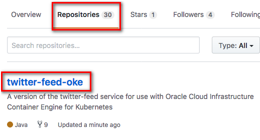

- Click **Create new file**

  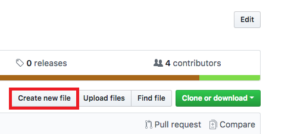

- In the **Name your file** input field, enter **kubernetes.yml.template**

  

- **Copy** the YAML below and **paste** it into the file editor.

    ```yaml
    apiVersion: extensions/v1beta1
    kind: Deployment
    metadata:
      name: twitter-feed-v1
      labels:
        commit: ${WERCKER_GIT_COMMIT}
    spec:
      replicas: 2
      selector:
        matchLabels:
          app: twitter-feed
      template:
        metadata:
          labels:
            app: twitter-feed
            commit: ${WERCKER_GIT_COMMIT}
        spec:
          containers:
          - name: twitter-feed
            image: ${DOCKER_REGISTRY}/${DOCKER_REPO}:${WERCKER_GIT_BRANCH}-${WERCKER_GIT_COMMIT}
            imagePullPolicy: Always
            ports:
            - name: twitter-feed
              containerPort: 8080
              protocol: TCP
          imagePullSecrets:
            - name: wercker
    ---
    apiVersion: v1
    kind: Service
    metadata:
      name: twitter-feed
      labels:
        app: twitter-feed
        commit: ${WERCKER_GIT_COMMIT}
    spec:
      ports:
      - port: 30000
        targetPort: 8080
      selector:
        app: twitter-feed
      type: ClusterIP
    ---
    ```
  >This configuration consists of two parts. The first section (up to line 28) defines a **Deployment**, which tells Kubernetes about the application we want to deploy. In this Deployment we instruct Kubernetes to create two Pods (`replicas: 2`) that will run our application. Within those pods, we specify that we want one Docker container to be run, and compose the link to the image for that container using environment variables specific to this workflow execution (`image: ${DOCKER_REPO}:${WERCKER_GIT_BRANCH}-${WERCKER_GIT_COMMIT}`).

  >The second part of the file defines a **Service**. A Service defines how Kubernetes should expose our application to traffic from outside the cluster. In this case, we are asking for a cluster-internal IP address to be assigned (`type: ClusterIP`). This means that our twitter feed will only be accessible from inside the cluster. This is ok, because the twitter feed will be consumed by the product catalog application that we will deploy later. We can still verify that our twitter feed is deployed properly -- we'll see how in a later step.

  >A `.yml` file is a common format for storing Kubernetes configuration data. The `.template` suffix in this file, however, is not a Kubernetes concept. We will use a Wercker step called **bash-template** to process any `.template` files in our project by substituting environment variables into the template wherever `${variables}` appear. You'll add that command to a new pipeline in the next step.

  - At the bottom of the page, click **Commit new file**

    

  - Since you've committed to the repository, Wercker will trigger another execution of your workflow. We haven't defined the deployment pipelines yet, so this will just result in a new entry in Wercker's Runs tab and a new image pushed to the container registry. You don't need to do anything with those; you can move on to the next step.

### **STEP 9**: Define Wercker Deployment Pipelines

  - Click the file **wercker.yml** and then click the **pencil** button to begin editing the file.

    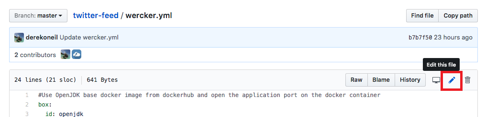

  - **Copy** the YAML below and **paste** it below the pipelines we defined earlier.

    ```yaml
    #Deploy our container from the Oracle Container Registry to the Oracle Container Engine (Kubernetes)
    deploy-to-cluster:
      box:
          id: alpine
          cmd: /bin/sh

      steps:

      - bash-template

      - kubectl:
          name: delete secret
          server: $KUBERNETES_MASTER
          token: $KUBERNETES_AUTH_TOKEN
          insecure-skip-tls-verify: true
          command: delete secret wercker; echo delete registry secret

      - kubectl:
          name: create secret
          server: $KUBERNETES_MASTER
          token: $KUBERNETES_AUTH_TOKEN
          insecure-skip-tls-verify: true
          command: create secret docker-registry wercker --docker-server=$DOCKER_REGISTRY --docker-email=nobody@oracle.com --docker-username=$DOCKER_USERNAME --docker-password='$OCI_AUTH_TOKEN'; echo create registry secret

      - script:
          name: "Visualise Kubernetes config"
          code: cat kubernetes.yml

      - kubectl:
          name: deploy to kubernetes
          server: $KUBERNETES_MASTER
          token: $KUBERNETES_AUTH_TOKEN
          insecure-skip-tls-verify: true
          command: apply -f kubernetes.yml
    ```

    >This will define a new **Pipeline** called deploy-to-cluster. The pipeline will make use of a new type of step: **kubectl**. If you have used Kubernetes before, you will be familiar with kubectl, the standard command line interface for managing Kubernetes. The kubectl Wercker step can be used to execute Kubernetes commands from within a Pipeline.

    >The **deploy-to-cluster** Pipeline will prepare our kubernetes.yml file by filling in some environment variables. It will then use kubectl to tell Kubernetes to apply that configuration to our cluster.

- At the bottom of the page, click **Commit new file**

  

- Since you've committed to the repository again, Wercker will once again trigger an execution of your workflow. We still haven't configured the deployment pipelines in Wercker yet, so we'll still end up with a new Run and a new image, but not a deployment to Kubernetes.

### **STEP 10**: Set up deployment pipelines in Wercker

- Open **[Wercker](https://app.wercker.com)** in a new tab or browser window, or switch to it if you already have it open. In the top navigation bar, click **Pipelines**, then click on your **twitter-feed-oke** application.

  

- On the **Runs** tab you can see that Wercker has triggered another execution of our build and publish workflow, but it has not executed our new deploy-to-cluster pipeline. This is because we have not added the new pipeline to the workflow definition yet. Let's do that now -- click on the **Workflows** tab, then click the **Add new pipeline** button.

  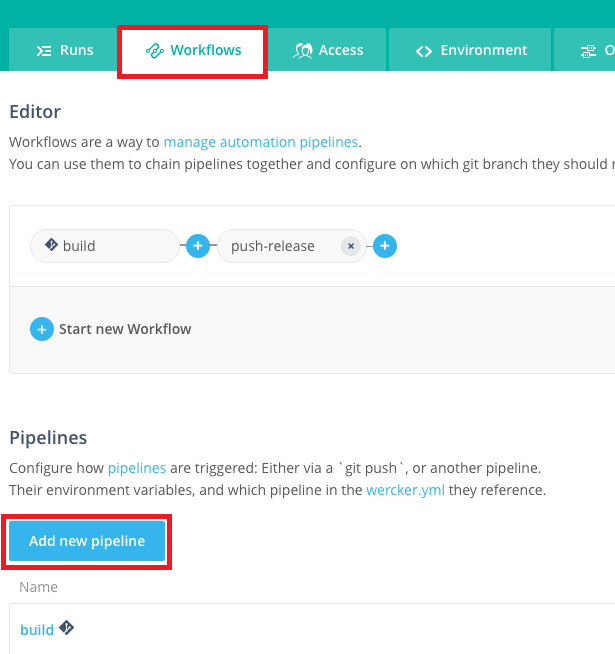

- Enter **deploy-to-cluster** into both the Name and YML Pipleine name fields. Click **Create**.

  

- Click the **Workflows** tab again to get back to the editor.

- Click the **plus** button to the right of the **push-release** pipeline to add to the workflow. In the **Execute Pipeline** drop down list, select **deploy-to-cluster** and click **Add**

  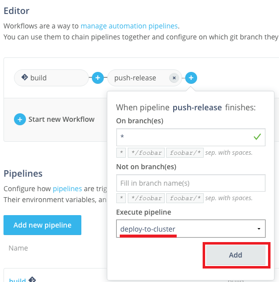

- Your overall Workflow should now have three Pipelines:

  

- Now we've got our workflow updated with our deployment pipelines, but there's one more thing we need to do before we can actually deploy. We need to set a few environment variables that tell Wercker the address of our Kubernetes master and provide authentication tokens for Wercker to issue commands to Kubernetes and to OCI.

### **STEP 11**: Set up environment variables in Wercker

- Our first step is to set our cluster's authentication token as a Wercker environment variable. In your **terminal window**, run the following commands to output the token, then **select it and copy it** to your clipboard:

  **Windows**
    ```bash
    cd %USERPROFILE%\container-workshop
    notepad kubeconfig
    ```

    - Find the `token:` section at the bottom of the file, and copy the token value from there.

    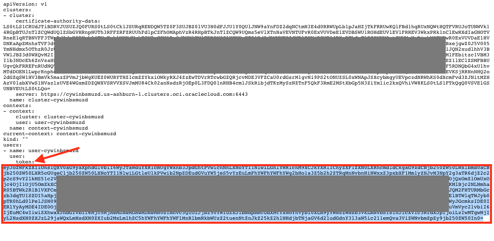

  **Mac/Linux**
    ```bash
    cd ~/container-workshop
    cat kubeconfig | grep token | awk '{print $2}'
    ```

    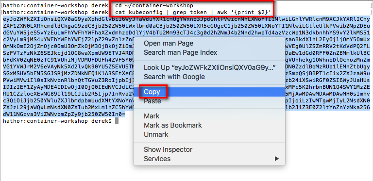

- Back in your Wercker browser tab, click the **Environment** tab. In the key field of the empty row below the last environment variable, enter the key **KUBERNETES_AUTH_TOKEN**. In the value field, **paste** the token we just copied. Check the **Protected** box and click **Add**.

  

- The next environment variable we need to add is the address of the Kubernetes master we want to deploy to. We can get the URL from `kubectl`. Run the following command in your **terminal window** to output the URL, then **select it and copy it** to your clipboard:

  **Windows**
    ```bash
    kubectl.exe config view | grep server | cut -f 2- -d ":" | tr -d " "
    ```

  **Mac/Linux**
    ```bash
    echo $(./kubectl config view | grep server | cut -f 2- -d ":" | tr -d " ")
    ```

- In your Wercker browser tab, add a new environment variable with the key **KUBERNETES_MASTER**. In the value field, **paste** the value you copied from `kubectl`. The value **must start with https://** for Wercker to communicate with the cluster. When finished, click **Add**.

  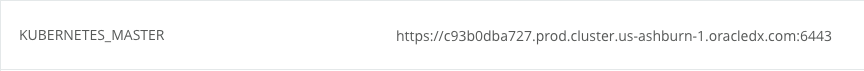

  **NOTE**: You can also find this address in the OCI Console OKE page, by clicking on your cluster name to view the detail page:

    

- The last environment variable we need to create in Wercker is a token for Wercker to authenticate to OCI so that it can push our Docker image to the OCI Repository (OCIR). We will generate this authentication token in the OCI Console and then paste it into a Wercker environment variable. Add a new environment variable with the key **OCI_AUTH_TOKEN**.

  

- Switch to your **OCI Console** browser tab. Use the navigation menu to go to Identity->Users and select **View User Details** from the three-dots menu for your user. If you've closed the tab, [log in again](https://console.us-ashburn-1.oraclecloud.com).

  

  **NOTE**: You may see two users in the list, one that is named with just your email address, and another that is named `oracleidentitycloudservice`/your-email-address. **Choose the one that is named just your-email-address.**

- In the Resources menu of the user settings page, click **Auth Tokens**. Then click **Generate Token**.

  

  

- In the Description field, enter **Wercker Pipeline Token** and click **Generate Token**.

  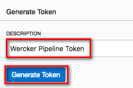

- Click the **Copy** link under the generated token, then click **Close**. Switch back to your Wercker browser tab and **Paste** this token into the Value field of the **OCI_AUTH_TOKEN** environment variable you started creating earlier. Check the **Protected** box and click **Save**.

  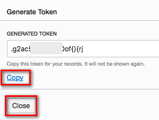

  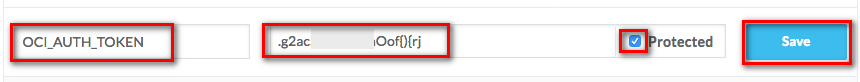

- Lastly, let's go back and look at the `DOCKER_REGISTRY` variable to ensure that we have specified the correct region. In the **OCI Console**, look in the top right corner for the currently selected region:

  

  - If the region is `ashburn`, then you do not need to change anything. The URL `iad.ocir.io` is correct.

  - If the region is not `ashburn`, replace the `iad` part of the `DOCKER_REGISTRY` environment variable to match your region:

  ```
  London = lhr
  Frankfurt = fra
  Phoenix = phx
  Ashburn = iad
  ```

  - For example, if your region is `eu-frankfurt-1`, change the URL to `fra.ocir.io` and click the **save** button

    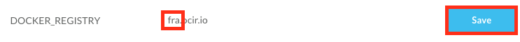


- Now we're ready to try out our workflow from start to finish. We could do that by making another commit on GitHub, since Wercker is monitoring our source code. We can also trigger a workflow execution right from Wercker. We'll see how in the next step.

### **STEP 12**: Trigger a retry of the pipeline

- On your Wercker application page in your browser, click the **Runs** tab. Your most recent run should have a successful build pipeline and a failed push-release pipeline. Click the **push-release** pipeline.

  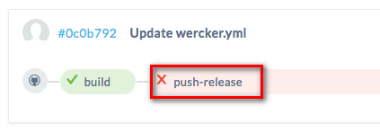

- Click the **Retry** button.

  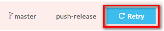

- Click the **Runs** tab so you can monitor the execution of the pipeline. Within a minute or so, the deployment pipeline should complete successfully. Now we can use the Kubernetes dashboard to inspect and validate our deployment.

  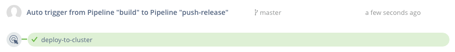

### **STEP 13**: Validate deployment

- First we will validate that our Docker image is visible in the OCI Registry. In your **OCI Console** browser tab, select **Registry (OCIR)** from the navigation menu, under the Developer Services category.

  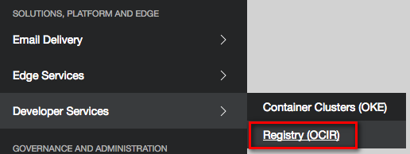

- Click on **twitter-feed** to expand the list of images, then click **master-xxxx** to view the details. This confirms that our image was pushed to the right place. The git branch and commit hash help us connect this image with the specific code version on GitHub.

  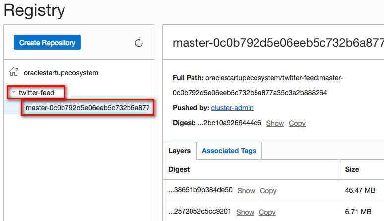

- If you prefer to use the command line as opposed to the web browser method of testing the service, run the following command to verify that our microservice is returning JSON data:

  **Mac/Linux/Git Bash**
  ```bash
  export KUBECONFIG=~/container-workshop/kubeconfig
  ./kubectl exec -it $(./kubectl get pod -l "app=twitter-feed" -o jsonpath='{.items[0].metadata.name}') -- /bin/sh -c '/usr/bin/curl -s http://$HOSTNAME:8080/statictweets | head -c 1000; echo'
  ```

  **Windows**
  ```bash
  set KUBECONFIG=%USERPROFILE%\container-workshop\kubeconfig
  kubectl.exe get pod -l "app=twitter-feed" -o jsonpath="{.items[0].metadata.name}" > podname.txt && FOR /F usebackq %A IN (`more podname.txt`) DO kubectl.exe exec -it %~A -- /bin/sh -c "/usr/bin/curl -s http://$HOSTNAME:8080/statictweets | head -c 1000; echo"
  ```

  - If you see JSON data returned, **skip to Step 14** where we will deploy the other components of our product catalog application. Otherwise, if the commands didn't work, you don't have PowerShell, or you prefer a browser-based interface, continue on:

- In a terminal window, start the **kubectl proxy** using the following command. Your `KUBECONFIG` environment variable should still be set from a previous step. If not, reset it.

  **Windows**
  ```bash
  kubectl.exe proxy
  ```

  **Mac/Linux**
  ```bash
  ./kubectl proxy
  ```

- In a browser tab, navigate to the [**Kubernetes dashboard**](http://localhost:8001/api/v1/namespaces/kube-system/services/https:kubernetes-dashboard:/proxy/)

- You should see the overview page. In the pods section, you should see two twitter-feed pods running. Click the **name of one of the pods** to go to the detail page.

  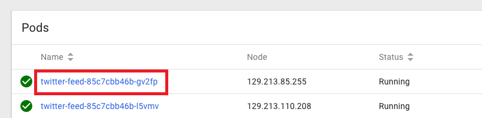

- On the pod detail page, in the top menu bar, click **Exec**. This will give us a remote shell on the pod where we can verify that our application is up and running.

  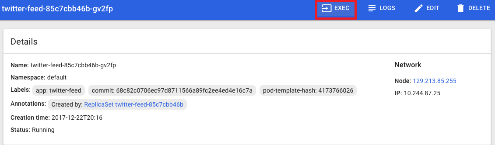

- In the shell that is displayed, **paste** the following command and press **Enter**.

  **NOTE:** You may need to use ctrl-shift-v to paste. Alternatively, you can use the mouse-driven browser menu to paste the command.

  `curl -s http://$HOSTNAME:8080/statictweets | head -c 100`

- You should see some JSON data being returned by our twitter feed service. Our microservice has been deployed successfully! But the twitter feed service is just one part of our product catalog application. Let's deploy the rest of the application so we can validate that everything works together as expected. Leave this browser tab open, as we will use it in a later step.

  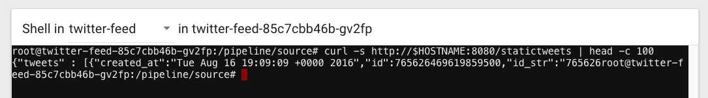

**NOTE**: You may be wondering why we had to use the Kubernetes remote terminal to test our application. Remember the kubernetes.yml file that we created earlier -- we specified a cluster-internal IP address for our twitter-feed service. This means that only other processes inside the cluster can reach our service. If we wanted to access our service from the internet, we could have used a load balancer instead.

## Deploy and Test the Product Catalog Application

### **STEP 14**: Download the Product Catalog Kubernetes YAML file

- From a browser, navigate to your forked twitter-feed repository on GitHub. If you've closed the tab, you can get back by going to [GitHub](https://github.com/), clicking the **Repositories** tab at the top of the page, and clicking the **twitter-feed-oke** link.

  

- Click on the **alpha-office-product-catalog.kubernetes.yml** file.

  

- Right click on the **Raw** button and choose **Save Link As** or **Save As**. In the save file dialog box that appears, note the location of the file and click **Save**

  

**NOTE**: This YAML file contains the configuration for a Kubernetes deployment and service, much like the configuration for our twitter feed microservice. In a normal development environment, the product catalog application would be managed by Wercker as well, so that builds and deploys would be automated. In this workshop, however, you will perform a one-off deployment of a pre-built Docker image containing the product catalog application from within the Kubernetes dashboard.

### **STEP 15**: Deploy and test the Product Catalog using the Kubernetes dashboard

- Switch back to your **Kubernetes dashboard** browser tab. If you have closed it, navigate to the Kubernetes dashboard at [**Kubernetes dashboard**](http://localhost:8001/api/v1/namespaces/kube-system/services/https:kubernetes-dashboard:/proxy/)

- In the upper right corner of the dashboard, click **Create**.

  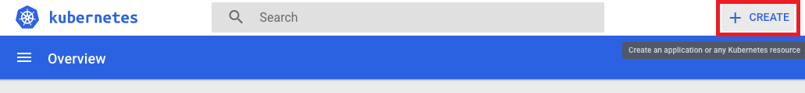

- Click the **Create From File** tab, then click the **three dots** button to browse for your file. In the dialog, select the YAML file you just downloaded from GitHub and click **Open**, then click **UPLOAD**.

  

- In the left side navigation menu, click **Overview**. You should see two new product-catalog-app pods being created and soon change state to Running.

  

- Instead of a cluster-internal IP address, the product-catalog-service will be exposed to the internet via a load balancer. The load balancer will take a few minutes to be instantiated and configured. Let's check on its status--click **Services** from the left side menu, then click on the **product-catalog-service**.

  

- On the service detail page, you will see a field called **External endpoints**. Once the load balancer has finished provisioning, the External endpoints field will be populated with a link to the product catalog application. If the link is not shown yet, wait a few minutes, refresh your browser, and check again. Once the link is displayed, **click it** to launch the site in a new tab.

  

- You should see the product catalog site load successfully, validating that our new Kubernetes deployment and service were created correctly. Let's test the twitter feed functionality of the catalog. Click the first product, **Crayola New Markers**. The product's twitter feed should be displayed.

  

  **NOTE**: You may have noticed that we did not need to alter the pre-built product catalog container with the URLs of the twitter feed pods or service. The product catalog app makes use of Kubernetes DNS to resolve the service name (twitter-feed) into its IP address. Kubernetes DNS assigns a DNS name to every service defined in your cluster, so any service can be looked up by doing a DNS query for the name of the service (prefixed by _`namespace.`_ if the service is in a different namespace from the requester). The product catalog server uses the following JavaScript code to make an HTTP request to the twitter feed microservice:

  `request('http://twitter-feed:30000/statictweets/color', function (error, response, body) { ... });`

- Some tweets are indeed displayed, but they aren't relevant to this product. It looks like there is a bug in our twitter feed microservice! Continue on to the next lab to explore how to make bug fixes and updates to our microservice.

**You are now ready to move to the next lab: [Lab 300](LabGuide300.md)**
