# Provision Kubernetes Using the OCI Console


## Introduction

This is the second of several labs that are part of the **Oracle Public Cloud Container Native Development workshop.** This workshop will walk you through the process of moving an existing application into a containerized CI/CD pipeline and deploying it to a Kubernetes cluster in the Oracle Public Cloud.

You will take on 2 personas during the workshop. The **Lead Developer Persona** will be responsible for configuring the parts of the automated build and deploy process that involve details about the application itself. The **DevOps Engineer Persona** will configure the parts of the automation involving the Kubernetes infrastructure. To containerize and automate the building and deploying of this application you will make use of Wercker Pipelines for CI/CD, OCI Registry for a container registry, and OCI Container Engine for Kubernetes for provisioning a Kubernetes cluster on Oracle Cloud Infrastructure.

During this lab, you will take on the **DevOps Engineer Persona**. You will provision a Kubernetes cluster and all of the infrastructure that it requires using the OCI console. OCI will provision the Virtual Cloud Network, Load Balancers, Kubernetes Master and Worker instances, and etcd instance required to support your cluster.

**_To log issues_**, click here to go to the [GitHub oracle](https://github.com/oracle/learning-library/issues/new) repository issue submission form.

## Objectives

**Automate Deployment to Kubernetes**

- Create and Deploy to a Kubernetes Cluster
  - Set Up Oracle Cloud infrastructure
  - Provision Kubernetes Using the OCI Console
  - Configure and Run Wercker Deployment Pipelines
  - Deploy and Test the Product Catalog Application

## Required Artifacts

- The following lab requires:
  - an Oracle Public Cloud account that will be supplied by your instructor, or a Trial Account

# Provision Kubernetes Using the OCI Console

## Set Up Oracle Cloud infrastructure

### **STEP 1**: Log in to your OCI dashboard

- If you are using a Trial Account, **you must wait until you receive this email** indicating that your Cloud Account has been provisioned. _Please note that this email may arrive in your spam or promotions folder pending your email settings._

  

- Once you receive the **Get Started with Oracle Cloud** Email, make note of your **Username, Password and Cloud Account Name**.

  

- From any browser go to:

    [https://cloud.oracle.com/en_US/sign-in](https://cloud.oracle.com/en_US/sign-in)

- Enter your **Cloud Account Name** in the input field and click the **My Services** button. If you have a trial account, this can be found in your welcome email. Otherwise, this will be supplied by your workshop instructor.

  

- Enter your **Username** and **Password** in the input fields and click **Sign In**. If you have a trial account, these can be found in your welcome email. Otherwise, these will be supplied by your workshop instructor.

  

**NOTE**: If you have used your trial account already, you may have been prompted to change the temporary password listed in the welcome email. In that case, enter the new password in the password field.

- In the top left corner of the dashboard, click the **hamburger menu**

  

- Click to expand the **Services** submenu, then click **Compute**

  

- On the OCI Console sign in page, enter the same **Username** as you did on the previous sign in page. If you are using a trial account and this is your first time logging into the OCI Console, enter the **temporary password** from your trial account welcome email. If you have already visited the OCI Console and changed your password, enter your **new password**. Otherwise, this password will be supplied by your workshop instructor.

  

### **STEP 2**: Create a Compartment for your Kubernetes nodes

Compartments are used to isolate resources within your OCI tenant. Role-based access policies can be applied to manage access to compute instances and other resources within a Compartment.

- Click the **hamburger icon** in the upper left corner to open the navigation menu. Under the **Identity** section of the menu, click **Compartments**

  

  - If you have a **Demo** compartment already, _**SKIP THIS STEP**_. Otherwise, Click **Create Compartment**

    

  - In the **Name** field, enter `Demo`. Enter a description of your choice. Click **Create Compartment**.

    

### **STEP 3**: Create a Cluster Administrator User

  - In order to create and manage Kubernetes clusters in OCI, we will need to create a local user with the correct roles and privileges. In the OCI Console navigation menu, choose **Identity->Users**

    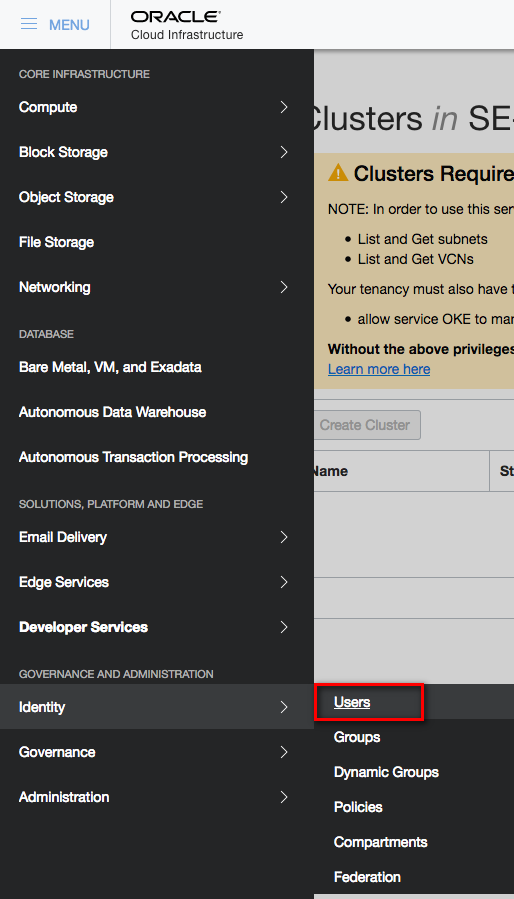

  - Click the **Create User** button

    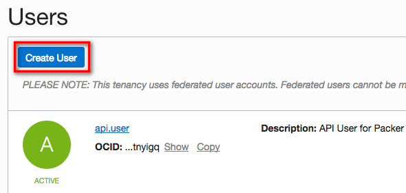

  - In the Name field, enter **cluster-admin**. Also enter a description for this user and click **Create**.

    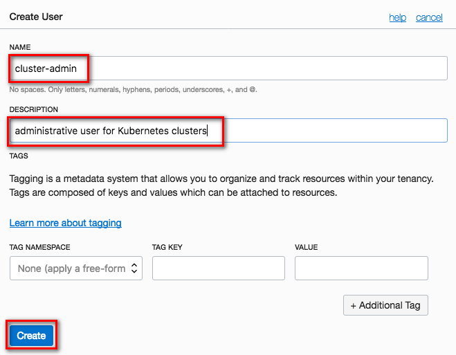

  - Now that we've created a user, we need to set the password. Click **cluster-admin** from the users list to view the account's detail page.

    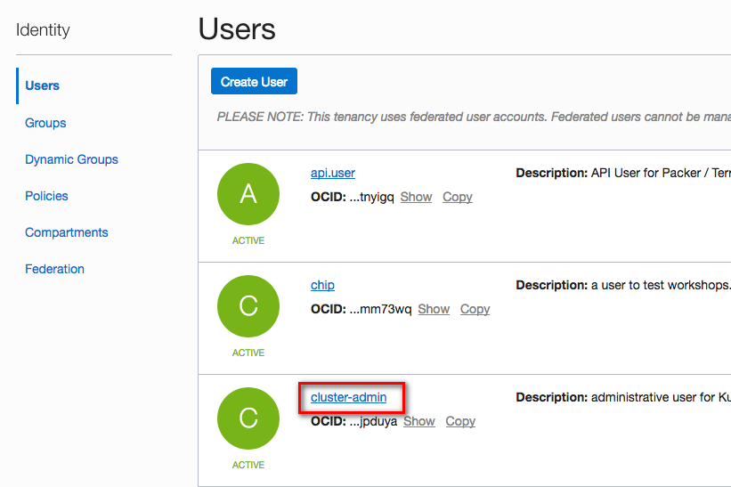

  - Click **Create/Reset Password**.

    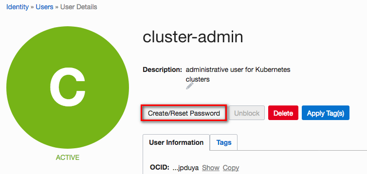

  - Click **Create/Reset Password** in the dialog box that appears. Then click **Copy**. **Paste** the password into a password manager or text file for later use. Click **Close**

    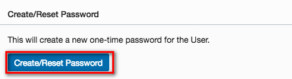
    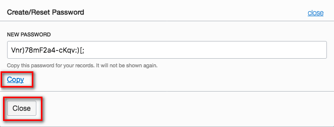

  - Now let's give our user the role they need to create infrastructure components in OCI. In the OCI Console navigation menu, select **Identity->Groups**.

    

  - Click **Administrators**

    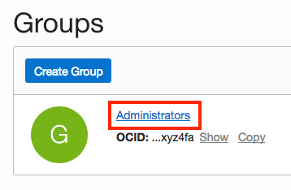

  - Click the **Add User to Group** button

    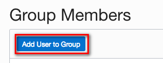

  - Select **cluster-admin** from the drop down list and click **Add**.

    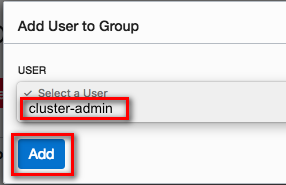

### **STEP 4**: Add a Policy Statement for OKE

  - Before the Oracle managed Kubernetes service can create compute instances in your OCI tenancy, we must explicitly give it permission to do so using a policy statement. From the OCI Console navigation menu, choose **Identity->Policies**.

    

  - In the Compartment drop down menu on the left side, choose the **root compartment**. It will have the same name as your OCI tenancy.

    

  - Click **PSM-root-policy**

    

  - Click the **Add Policy Statement** button

    

  - In the Statement box, enter: `allow service OKE to manage all-resources in tenancy` and click **Add Statement**

    

### **STEP 5**: Create a Virtual Cloud Network for your Kubernetes Cluster

  - Before we can allow OKE to launch Kubernetes components in your tenancy, we must create a Virtual Cloud Network with several subnets to host the Kubernetes worker nodes and load balancers. To begin, choose **Networking->Virtual Cloud Networks** from the OCI Console navigation menu.

    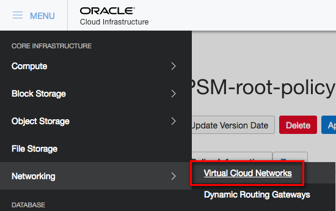

  - Select the **Demo compartment** you created from the Compartment drop  own list on the left side of the page. Then click the **Create Virtual Cloud Network** button.

    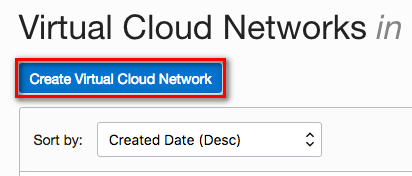

  - Select the radio button for **Create Virtual Cloud Network Plus Related Resources** and click **Create Virtual Cloud Network**. If a summary dialog is displayed, click **Close** to dismiss it.

    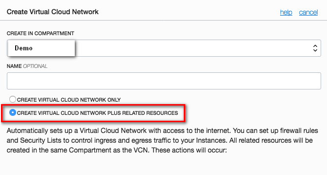
    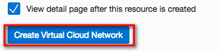
    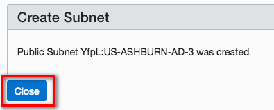

  - Now that we have created a new VCN, we need to open up the security list to allow traffic between our worker node subnets as well as inbound from the Kubernetes master nodes which are managed by Oracle. Click the **name of the new network (vcn201...)** to view the detail page, then click the name of the security list, **Default Security List for vcn201...**.

    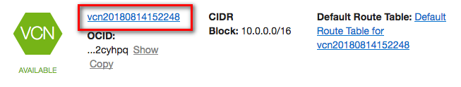
    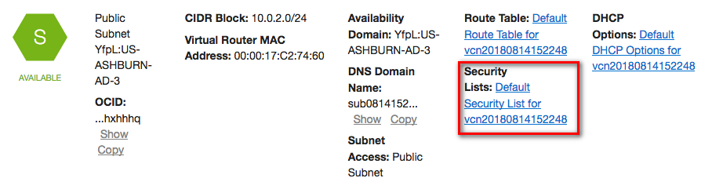

  - Click the **Edit All Rules** button.

    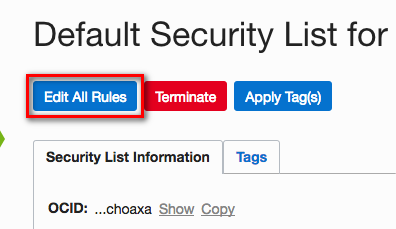

  - _**IMPORTANT**_: For the purposes of this workshop, we are going to configure our network security list to **allow all inbound and outbound traffic to and from our Kubernetes worker nodes**. In a production or production-like environment, this would not be appropriate, as much more restrictive security list rules would provide a layer of protection against attacks targeting the worker nodes.

  Using these permissive rules, we are relying on the OS-level firewall to protect the worker nodes from unauthorized access. Please see the appendix lab guide **Network Security Best Practices** for an example of a production-ready networking setup for OKE.

  - Under the **Allow Rules for Ingress** section, click **Add Rule**. Fill in the new rule as follows:
    - Stateless: **checked**
    - Source CIDR: **0.0.0.0/0**
    - IP Protocol: **All Protocols**

  - Under the **Allow Rules for Egress** section, check the box for **Stateless** next to the existing rule (0.0.0.0/0 for All Protocols), then click **Save Security List Rules**

    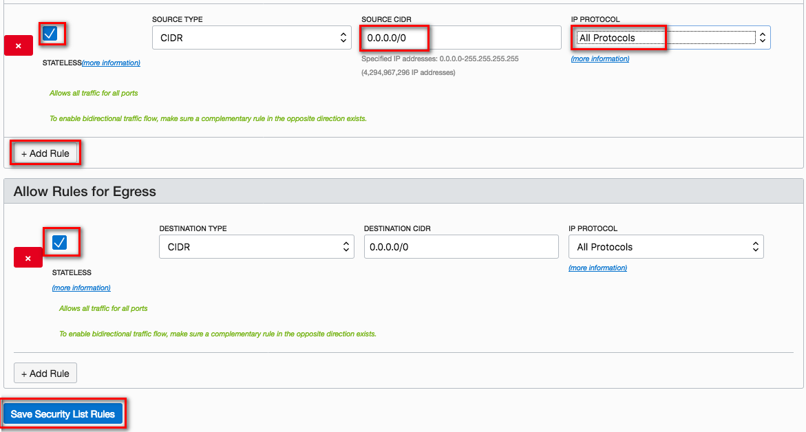

  - At this point, our networking is all set up and ready for us to create our Kubernetes worker nodes and load balancers. Our next step will be to launch a compute instance in the cloud which we will use to interact with the cluster via its API once it is set up. The instance will take a few minutes to launch, so we'll start it now and come back to it in a later step.

### **STEP 6**: Launch a Cloud Compute Instance for Cluster Management

  - Before we can launch a compute instance, we need to generate an SSH key pair to be able to authenticate to the instance once created. The method of generating an SSH key pair will depend on your operating system.

    **NOTE**: There are several files that will be downloaded or created on your local machine during this workshop. We recommend creating a directory to store them in for ease of locating and cleaning up. In this step, you will create a directory inside your home/user directory called `container-workshop`. You are free to change the location and name of this directory, but the lab guide will assume it is located at `~/container-workshop/`. **You will need to modify the given terminal commands throughout this lab** if you change the location or name of the directory.

    **Mac/Linux**:

      - Open a terminal or shell window and run the following commands:

        ```bash
        cd ~
        mkdir container-workshop && cd container-workshop && mkdir ssh-keys && cd ssh-keys
        ssh-keygen -f ./ssh-key -N ""
        ```
        

    **Windows**:

      - If you don't already have them, download PuTTY and PuTTYgen from [http://www.putty.org/](http://www.putty.org/)

        
        

      - Locate and run **puttygen.exe** in the PuTTY install folder.

      - Click **Generate**

        

      - **Move your mouse around the blank area** as instructed to genereate random data.

        

      - Click **Save private key** and then click **Yes** to continue saving without a passphrase.

        

        - In the save dialog box:
          - Navigate to your home directory/user folder (usually **C:\Users\<username>**).
          - Click **New Folder** and name the folder `container-workshop`.

            
          - **Double-click** the `container-workshop` folder to enter it.
          - Click **New Folder** again. This time name the folder `ssh-keys`.

            
          - **Double click** on `ssh-keys` to enter that folder.
          - Finally, name the key **ssh-key.ppk** and click **Save**.

            

      - Select and copy the **public key** using Control-C, which is displayed in the `Public key for pasting into OpenSSH authorized_keys file` region. Paste it into a **new text file** using **notepad** and save the file in the `C:\Users\username\container-workshop\ssh-keys` folder.

        **NOTE**: Do not use the Save public key button, as it uses an incompatible key format.

        
        

      - When you SSH to your instance in a later step, use PuTTY to connect instead of a command-line ssh session.

  - With the keys generated, we are ready to launch an instance. From the OCI Console navigation menu, select **Compute->Instances**. Ensure you are still working in the **Demo** compartment using the drop down list in the left pane.

    

  - Click the **Create Instance** button.

    

  - In the Shape drop down, change the Shape to **VM.Standard1.1**.

    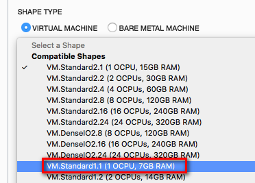

  - In the Choose SSH Key files area, click **Browse** and select the **ssh public key** you generated at the beginning of this step (e.g. `~/container-workshop/ssh-keys/ssh-key.pub`).

    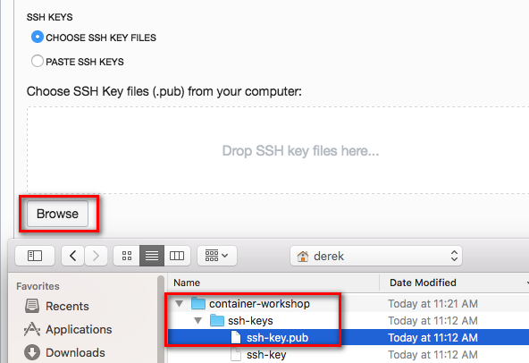

  - In the Subnet drop down list, select **Public Subnet xxx:US-YYYY-AD-1**

    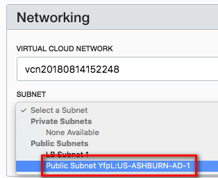

  - Click **Create Instance**

    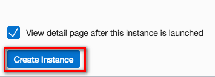

  - While the instance provisions, we can move on to creating our Kubernetes cluster. We will come back to this instance after the cluster is created to access our `kubeconfig` file.

### **STEP 7**: Provision Kubernetes Using the OCI Console

  - To create our Kubernetes cluster, we will need to use the `cluster-admin` user that we created earler. From the **user menu** in the upper right corner, click **Sign Out**

    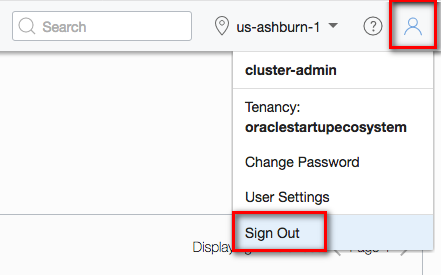

  - At the sign-in page, enter your username and password in the boxes on the right, under the Oracle Cloud Infrastructure section. Enter **cluster-admin** for the username and the temporary password you saved in **Step 3**.

    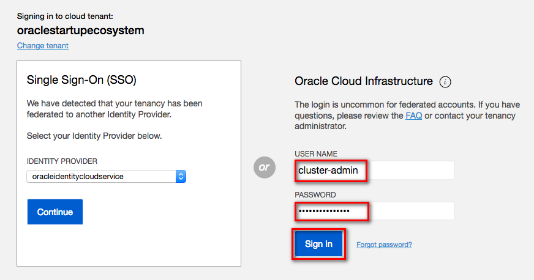

  - You will be prompted to change the temporary password. Enter the temporary password again in the **Current Password** field, and enter a new password of your choice in the two **New Password** fields. Click **Save New Password**.

    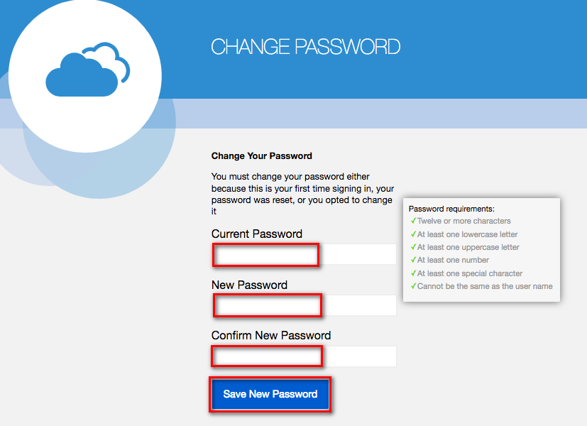

  - Once you are signed in as `cluster-admin`, you are ready to create a Kubernetes cluster. From the OCI Console navigation menu, select **Developer Services->Container Clusters (OKE)**.

    

  - In the Compartments drop down, select the **Demo** compartment.

    

  - Click **Create Cluster**

    

  - Fill out the form with the following information:
    - Name: **managed-kubernetes**
    - Version: **1.10.3**
    - VCN: **vcn201...**
    - Kubernetes LB Subnets: **Public Subnet xxxx:US-YYYY-AD-1** and **Public Subnet xxxx:US-YYYY-AD-2**
    - Leave the CIDR blocks and Additional Add Ons at their defaults

      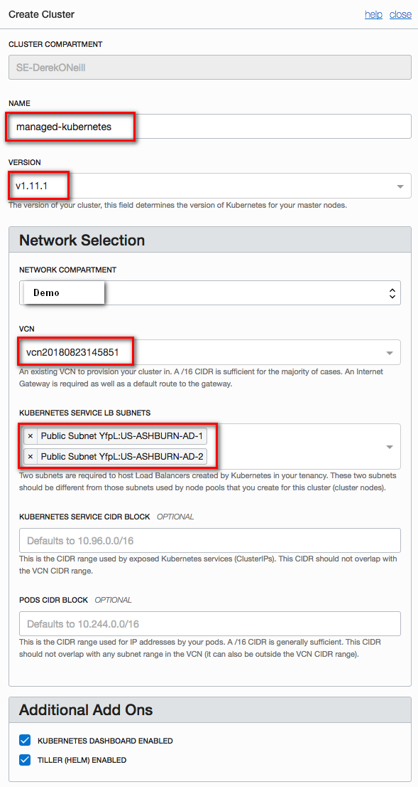

    - Click **Add Node Pool**
    - In the **Node Pool** configuration section, enter:
      - Name: **node-pool-1**
      - Version: **1.10.3**
      - Image: **Oracle-Linux-7.4**
      - Shape: **VM.Standard2.1**
      - Subnets: **Public Subnet xxxx:US-YYYY-AD-3**
      - Quantity Per Subnet: **2**

      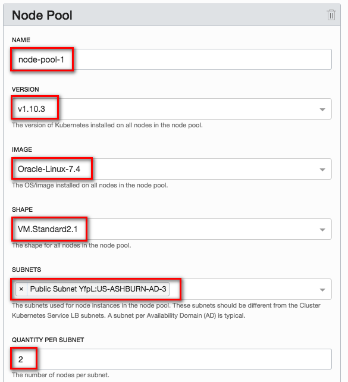

  - Then click **Create**. Your cluster will show up in the table with the status **Creating**. It will take several minutes to become available. While it provisions, we can go back to our client instance and prepare it for command line access to our cluster.

    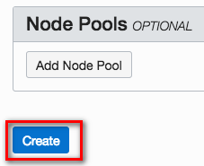

    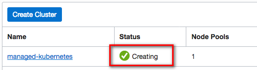

### **STEP 8**: Prepare OCI CLI for Cluster Access and Download kubeconfig

  - From the OCI Console navigation menu, select **Compute->Instances**
    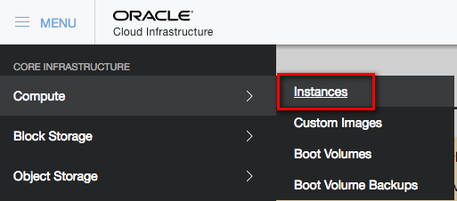

  - The instance we created earlier should be in the Running state. Click its name, **instance-201xxxxx-yyyy**.
    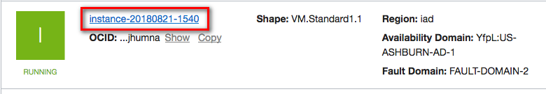

  - On the instance details page, find the **Public IP Address** and copy it to the clipboard.
    

  - Open an SSH connection to the instance using the following OS-specific method:

    **Mac/Linux**
      - Open a terminal or shell window
      - Run the following commands, pasting in the **Public IP Address** from your clipboard in place of <Public IP Address>

        ```
        cd ~/container-workshop/ssh-keys/
        ssh -i ssh-key opc@<Public IP Address>
        ```
      - Type **yes** and **press enter** when asked if you want to continue connecting

        

    **Windows**
      - Open PuTTY
      - In the Category pane, select Session and enter the following:
        - Host Name (or IP address): **opc@[Public IP Address you copied to the clipboard]**
        - Connection type: SSH
        - Port: 22
      - In the Category pane, expand Connection, expand SSH, and then click **Auth**. Click **Browse** and select your private key (for example, **C:\Users\\<username\>\container-workshop\ssh-keys\ssh-key.ppk**).
      - Click **Open** to start the session.

  - From _inside the SSH session_, run the following command to install the OCI CLI, which will allow you to interact with your cluster:

    `bash -c "$(curl -L https://raw.githubusercontent.com/oracle/oci-cli/master/scripts/install/install.sh)"`

    

  - For each of the prompts, accept the default by **pressing enter**

    

  - When the install is finished, configure the OCI CLI by running `oci setup config` in your SSH session. In a web browser on your local machine, open your **User Settings** page by selecting User Settings from the user menu in the top right corner. You will need some details from this page to complete the setup.

    

  - After initiating `oci setup config`, respond to the prompts as follows:
    - Enter a location for your config: **accept default by pressing enter**
    - Enter a user OCID: copy your OCID by clicking **Copy** in the **User Information** box in OCI Console
    - Enter a tenancy OCID: copy the **Tenancy OCID** from the tenancy details page (found under the administration section of the OCI navigation menu)
    - Enter a region: type the **region shown in the upper right** corner of OCI Console
    - Do you want to generate a new RSA key pair?: **Y**
    - Enter a directory for your keys to be created: **accept default by pressing enter**
    - Enter a name for your key: **accept default by pressing enter**
    - Enter a passphrase for your private key: **accept default by pressing enter**

    

  - You've just generated an RSA key pair that we will use to authenticate you to the OCI API. On the User Settings page in your browser, click **Add Public Key**

    

  - We need to copy and paste the public key into this box. In your _SSH session_, run the following command to output the public key:

    `cat /home/opc/.oci/oci_api_key_public.pem`

    

  - Select the entire key, beginning with: `-----BEGIN PUBLIC KEY-----` and ending with `-----END PUBLIC KEY-----`. **Copy it** and **paste it** into the Public Key text area in the OCI Console Add Public Key dialog. Then click **Add**.

    

  - You are now ready to download the `kubeconfig` file using the OCI CLI that you just installed. From the OCI Console navigation menu, select **Developer Services->Container Clusters (OKE)**, then click the name of your cluster, **managed-kubernetes**

    

    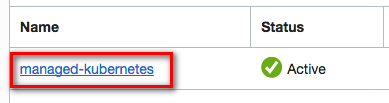

  - Click **Access Kubeconfig**.

    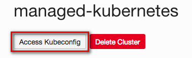

  - Two commands are displayed in the dialog box. **Copy and paste** each command (one at a time) into your _SSH session_ and run them. The first creates a directory to store the `kubeconfig` file, and the second invokes the OCI CLI to download and store the `kubeconfig` file on your client virtual machine. Then click **Close**.

    

    

    

    **NOTE**: Copy and paste the commands from the OCI Console window -- the second command below is personalized with your cluster OCID. They are listed here for reference only.

    >mkdir -p $HOME/.kube

    >oci ce cluster create-kubeconfig --cluster-id <your-kubernetes-cluster-ocid\> --file $HOME/.kube/config

  - Your `kubeconfig` file was downloaded from OCI and stored in ~/.kube/config. In your _SSH session_, **run** `cat ~/.kube/config` to output the contents of the file. **Copy** the contents and **paste** them into a new text file on your local machine. Name the file `kubeconfig` and **Save** the file to your **container-workshop directory** (e.g. `~/container-workshop/` or `C:\Users\<username>\container-workshop\`)

    **NOTE**: Save the `kubeconfig` file as a plain text file, not as a .docx, .rtf, .html, etc.

    

  - In order to interact with your cluster and view the dashboard, you will need to install the Kubernetes command line interface, `kubectl`. We will do that next.

### **STEP 9**: Install and Test kubectl on Your Local Machine

  - The method you choose to install `kubectl` will depend on your operating system and any package managers that you may already use. The generic method of installation, downloading the binary file using `curl`, is given below (**run the appropriate command in a terminal or command prompt**). If you prefer to use a package manager such as apt-get, yum, homebrew, chocolatey, etc, please find the specific command in the [Kubernetes Documentation](https://kubernetes.io/docs/tasks/tools/install-kubectl/).


    **Windows**
      ```bash
      cd %USERPROFILE%\container-workshop
      curl -LO https://storage.googleapis.com/kubernetes-release/release/v1.11.2/bin/windows/amd64/kubectl.exe
      ```

    **Mac**
      ```bash
      cd ~/container-workshop
      curl -LO https://storage.googleapis.com/kubernetes-release/release/$(curl -s https://storage.googleapis.com/kubernetes-release/release/stable.txt)/bin/darwin/amd64/kubectl
      chmod +x ./kubectl
      ```

    **Linux**
      ```bash
      cd ~/container-workshop
      curl -LO https://storage.googleapis.com/kubernetes-release/release/$(curl -s https://storage.googleapis.com/kubernetes-release/release/stable.txt)/bin/linux/amd64/kubectl
      chmod +x ./kubectl
      ```

  - In your terminal window or command prompt, run the following commands to verify that `kubectl` is able to communicate with your cluster. You should see `cluster-info` print out the URL of the Kubernetes Master node and `get nodes` print out the IP address and status of each of the worker nodes.

    **Windows**
      ```bash
      set KUBECONFIG=%USERPROFILE%\container-workshop\kubeconfig
      kubectl.exe cluster-info
      kubectl.exe get nodes
      ```

    **Mac/Linux**
      ```bash
      export KUBECONFIG=~/container-workshop/kubeconfig
      ./kubectl cluster-info
      ./kubectl get nodes
      ```

  - Now that we have verified that `kubectl` is connected to our cluster, we can use it to start a proxy that will give us access to the Kubernetes Dashboard through a web browser at a localhost URL. Run the following command in the same terminal window:

    **Windows**
      ```bash
      kubectl.exe proxy
      ```

    **Mac/Linux**
      ```bash
      ./kubectl proxy
      ```

- Leave the proxy server running and navigate to the [Kubernetes Dashboard by Right Clicking on this link](http://localhost:8001/api/v1/namespaces/kube-system/services/https:kubernetes-dashboard:/proxy/), and choosing **open in a new browser tab**.

- You are asked to authenticate to view the dashboard. Click **Choose kubeconfig file** and select your `kubeconfig` file from the folder `~/container-workshop/kubeconfig`. Click **Open**, then click **Sign In**.

  

- After authenticating, you are presented with the Kubernetes dashboard.

  

- Great! We've got Kubernetes installed and accessible -- now we're ready to get our microservice deployed to the cluster. The next step is to tell Wercker how and where we would like to deploy our application. In your **terminal window**, press **Control-C** to terminate `kubectl proxy`. We will need the terminal window to gather some cluster info in another step. We'll start the proxy again later.

## Configure and Run Wercker Deployment Pipelines

### **STEP 10**: Define Kubernetes Deployment Specification

- From a browser, navigate to your forked twitter-feed repository on GitHub. If you've closed the tab, you can get back by going to [GitHub](https://github.com/), clicking the **Repositories** tab at the top of the page, and clicking the **twitter-feed-oke** link.

  

- Click **Create new file**

  

- In the **Name your file** input field, enter **kubernetes.yml.template**

  

- **Copy** the YAML below and **paste** it into the file editor.

    ```yaml
    apiVersion: extensions/v1beta1
    kind: Deployment
    metadata:
      name: twitter-feed-v1
      labels:
        commit: ${WERCKER_GIT_COMMIT}
    spec:
      replicas: 2
      selector:
        matchLabels:
          app: twitter-feed
      template:
        metadata:
          labels:
            app: twitter-feed
            commit: ${WERCKER_GIT_COMMIT}
        spec:
          containers:
          - name: twitter-feed
            image: ${DOCKER_REGISTRY}/${DOCKER_REPO}:${WERCKER_GIT_BRANCH}-${WERCKER_GIT_COMMIT}
            imagePullPolicy: Always
            ports:
            - name: twitter-feed
              containerPort: 8080
              protocol: TCP
          imagePullSecrets:
            - name: wercker
    ---
    apiVersion: v1
    kind: Service
    metadata:
      name: twitter-feed
      labels:
        app: twitter-feed
        commit: ${WERCKER_GIT_COMMIT}
    spec:
      ports:
      - port: 30000
        targetPort: 8080
      selector:
        app: twitter-feed
      type: ClusterIP
    ---
    ```
  >This configuration consists of two parts. The first section (up to line 28) defines a **Deployment**, which tells Kubernetes about the application we want to deploy. In this Deployment we instruct Kubernetes to create two Pods (`replicas: 2`) that will run our application. Within those pods, we specify that we want one Docker container to be run, and compose the link to the image for that container using environment variables specific to this workflow execution (`image: ${DOCKER_REPO}:${WERCKER_GIT_BRANCH}-${WERCKER_GIT_COMMIT}`).

  >The second part of the file defines a **Service**. A Service defines how Kubernetes should expose our application to traffic from outside the cluster. In this case, we are asking for a cluster-internal IP address to be assigned (`type: ClusterIP`). This means that our twitter feed will only be accessible from inside the cluster. This is ok, because the twitter feed will be consumed by the product catalog application that we will deploy later. We can still verify that our twitter feed is deployed properly -- we'll see how in a later step.

  >A `.yml` file is a common format for storing Kubernetes configuration data. The `.template` suffix in this file, however, is not a Kubernetes concept. We will use a Wercker step called **bash-template** to process any `.template` files in our project by substituting environment variables into the template wherever `${variables}` appear. You'll add that command to a new pipeline in the next step.

  - At the bottom of the page, click **Commit new file**

    

  - Since you've committed to the repository, Wercker will trigger another execution of your workflow. We haven't defined the deployment pipelines yet, so this will just result in a new entry in Wercker's Runs tab and a new image pushed to the container registry. You don't need to do anything with those; you can move on to the next step.

### **STEP 11**: Define Wercker Deployment Pipelines

  - Click the file **wercker.yml** and then click the **pencil** button to begin editing the file.

    

  - **Copy** the YAML below and **paste** it below the pipelines we defined earlier.

      ```yaml
      #Deploy our container from the Oracle Container Registry to the Oracle Container Engine (Kubernetes)
      deploy-to-cluster:
        box:
            id: alpine
            cmd: /bin/sh

        steps:

        - bash-template

        - kubectl:
            name: delete secret
            server: $KUBERNETES_MASTER
            token: $KUBERNETES_AUTH_TOKEN
            insecure-skip-tls-verify: true
            command: delete secret wercker; echo delete registry secret

        - kubectl:
            name: create secret
            server: $KUBERNETES_MASTER
            token: $KUBERNETES_AUTH_TOKEN
            insecure-skip-tls-verify: true
            command: create secret docker-registry wercker --docker-server=$DOCKER_REGISTRY --docker-email=nobody@oracle.com --docker-username=$DOCKER_USERNAME --docker-password='$OCI_AUTH_TOKEN'; echo create registry secret

        - script:
            name: "Visualise Kubernetes config"
            code: cat kubernetes.yml

        - kubectl:
            name: deploy to kubernetes
            server: $KUBERNETES_MASTER
            token: $KUBERNETES_AUTH_TOKEN
            insecure-skip-tls-verify: true
            command: apply -f kubernetes.yml
      ```

    >This will define a new **Pipeline** called deploy-to-cluster. The pipeline will make use of a new type of step: **kubectl**. If you have used Kubernetes before, you will be familiar with kubectl, the standard command line interface for managing Kubernetes. The kubectl Wercker step can be used to execute Kubernetes commands from within a Pipeline.

    >The **deploy-to-cluster** Pipeline will prepare our kubernetes.yml file by filling in some environment variables. It will then use kubectl to tell Kubernetes to apply that configuration to our cluster.

- At the bottom of the page, click **Commit new file**

  

- Since you've committed to the repository again, Wercker will once again trigger an execution of your workflow. We still haven't configured the deployment pipelines in Wercker yet, so we'll still end up with a new Run and a new image, but not a deployment to Kubernetes.

### **STEP 12**: Set up deployment pipelines in Wercker

- Open **[Wercker](https://app.wercker.com)** in a new tab or browser window, or switch to it if you already have it open. In the top navigation bar, click **Pipelines**, then click on your **twitter-feed** application.

  

- On the **Runs** tab you can see that Wercker has triggered another execution of our build and publish workflow, but it has not executed our new deploy-to-cluster pipeline. This is because we have not added the new pipeline to the workflow definition yet. Let's do that now -- click on the **Workflows** tab, then click the **Add new pipeline** button.

  

- Enter **deploy-to-cluster** into both the Name and YML Pipleine name fields. Click **Create**.

  

- Click the **Workflows** tab again to get back to the editor.

- Click the **plus** button to the right of the **push-release** pipeline to add to the workflow. In the **Execute Pipeline** drop down list, select **deploy-to-cluster** and click **Add**

  

- Your overall Workflow should now have three Pipelines:

  

- Now we've got our workflow updated with our deployment pipelines, but there's one more thing we need to do before we can actually deploy. We need to set a few environment variables that tell Wercker the address of our Kubernetes master and provide authentication tokens for Wercker to issue commands to Kubernetes and to OCI.

### **STEP 13**: Set up environment variables in Wercker

- Our first step is to set our cluster's authentication token as a Wercker environment variable. In your **terminal window**, run the following commands to output the token, then **select it and copy it** to your clipboard:

  **Windows**
    ```bash
    cd %USERPROFILE%\container-workshop
    cat kubeconfig | grep token | awk '{print $2}'
    ```

  **Mac/Linux**
    ```bash
    cd ~/container-workshop
    cat kubeconfig | grep token | awk '{print $2}'
    ```

    

- Back in your Wercker browser tab, click the **Environment** tab. In the key field of the empty row below the last environment variable, enter the key **KUBERNETES_AUTH_TOKEN**. In the value field, **paste** the token we just copied. Check the **Protected** box and click **Add**.

  

- The next environment variable we need to add is the address of the Kubernetes master we want to deploy to. We can get the URL from `kubectl`. Run the following command in your **terminal window** to output the URL, then **select it and copy it** to your clipboard:

  **Windows**
    ```bash
    kubectl.exe config view | grep server | cut -f 2- -d ":" | tr -d " "
    ```

  **Mac/Linux**
    ```bash
    echo $(kubectl config view | grep server | cut -f 2- -d ":" | tr -d " ")
    ```

- In your Wercker browser tab, add a new environment variable with the key **KUBERNETES_MASTER**. In the value field, **paste** the value you copied from `kubectl`. The value **must start with https://** for Wercker to communicate with the cluster. When finished, click **Add**.

  

  **NOTE**: You can also find this address in the OCI Console OKE page, by clicking on your cluster name to view the detail page:

    

- The last environment variable we need to create in Wercker is a token for Wercker to authenticate to OCI so that it can push our Docker image to the OCI Repository (OCIR). We will generate this authentication token in the OCI Console and then paste it into a Wercker environment variable. Add a new environment variable with the key **OCI_AUTH_TOKEN**.

  

- Switch to your **OCI Console** browser tab and select **User Settings** from the user drop down menu in the upper right corner. You should still be logged in as `cluster-admin`. If you've closed the tab, [log in again](https://console.us-ashburn-1.oraclecloud.com).

  

- In the Resources menu of the user settings page, click **Auth Tokens**. Then click **Generate Token**.

  

  

- In the Description field, enter **Wercker Pipeline Token** and click **Generate Token**.

  

- Click the **Copy** link under the generated token, then click **Close**. Switch back to your Wercker browser tab and **Paste** this token into the Value field of the **OCI_AUTH_TOKEN** environment variable you started creating earlier. Check the **Protected** box and click **Save**.

  

  

- Now we're ready to try out our workflow from start to finish. We could do that by making another commit on GitHub, since Wercker is monitoring our source code. We can also trigger a workflow execution right from Wercker. We'll see how in the next step.

### **STEP 14**: Trigger a retry of the pipeline

- On your Wercker application page in your browser, click the **Runs** tab. Your most recent run should have a successful build pipeline and a failed push-release pipeline. Click the **push-release** pipeline.

  

- Click the **Retry** button.

  

- Click the **Runs** tab so you can monitor the execution of the pipeline. Within a minute or so, the deployment pipeline should complete successfully. Now we can use the Kubernetes dashboard to inspect and validate our deployment.

  

### **STEP 15**: Validate deployment

- First we will validate that our Docker image is visible in the OCI Registry. In your **OCI Console** browser tab, select **Registry (OCIR)** from the navigation menu, under the Developer Services category.

  

- Click on **twitter-feed** to expand the list of images, then click **master-xxxx** to view the details. This confirms that our image was pushed to the right place. The git branch and commit hash help us connect this image with the specific code version on GitHub.

  


- In a terminal window, start the **kubectl proxy** using the following command. Your `KUBECONFIG` environment variable should still be set from a previous step. If not, reset it.

  ```bash
  kubectl proxy
  ```

- In a browser tab, navigate to the [**Kubernetes dashboard**](http://localhost:8001/api/v1/namespaces/kube-system/services/https:kubernetes-dashboard:/proxy/)

- You should see the overview page. In the pods section, you should see two twitter-feed pods running. Click the **name of one of the pods** to go to the detail page.

  

- On the pod detail page, in the top menu bar, click **Exec**. This will give us a remote shell on the pod where we can verify that our application is up and running.

  

- In the shell that is displayed, **paste** the following command and press **Enter**.

  **NOTE:** You may need to use ctrl-shift-v to paste. Alternatively, you can use the mouse-driven browser menu to paste the command.

  `curl -s http://$HOSTNAME:8080/statictweets | head -c 100`

- You should see some JSON data being returned by our twitter feed service. Our microservice has been deployed successfully! But the twitter feed service is just one part of our product catalog application. Let's deploy the rest of the application so we can validate that everything works together as expected. Leave this browser tab open, as we will use it in a later step.

  

**NOTE**: You may be wondering why we had to use the Kubernetes remote terminal to test our application. Remember the kubernetes.yml file that we created earlier -- we specified a cluster-internal IP address for our twitter-feed service. This means that only other processes inside the cluster can reach our service. If we wanted to access our service from the internet, we could have used a load balancer instead.

## Deploy and Test the Product Catalog Application

### **STEP 16**: Download the Product Catalog Kubernetes YAML file

- From a browser, navigate to your forked twitter-feed repository on GitHub. If you've closed the tab, you can get back by going to [GitHub](https://github.com/), clicking the **Repositories** tab at the top of the page, and clicking the **twitter-feed-oke** link.

  

- Click on the **alpha-office-product-catalog.kubernetes.yml** file.

  

- Right click on the **Raw** button and choose **Save Link As** or **Save As**. In the save file dialog box that appears, note the location of the file and click **Save**

  

**NOTE**: This YAML file contains the configuration for a Kubernetes deployment and service, much like the configuration for our twitter feed microservice. In a normal development environment, the product catalog application would be managed by Wercker as well, so that builds and deploys would be automated. In this workshop, however, you will perform a one-off deployment of a pre-built Docker image containing the product catalog application from within the Kubernetes dashboard.

### **STEP 17**: Deploy and test the Product Catalog using the Kubernetes dashboard

- Switch back to your **Kubernetes dashboard** browser tab. If you have closed it, navigate to the Kubernetes dashboard at [**Kubernetes dashboard**](http://localhost:8001/api/v1/namespaces/kube-system/services/https:kubernetes-dashboard:/proxy/)

- In the upper right corner of the dashboard, click **Create**.

  

- Click the **Create From File** tab, then click the **three dots** button to browse for your file. In the dialog, select the YAML file you just downloaded from GitHub and click **Open**, then click **UPLOAD**.

  

- In the left side navigation menu, click **Overview**. You should see two new product-catalog-app pods being created and soon change state to Running.

  

- Instead of a cluster-internal IP address, the product-catalog-service will be exposed to the internet via a load balancer. The load balancer will take a few minutes to be instantiated and configured. Let's check on its status--click **Services** from the left side menu, then click on the **product-catalog-service**.

  

- On the service detail page, you will see a field called **External endpoints**. Once the load balancer has finished provisioning, the External endpoints field will be populated with a link to the product catalog application. If the link is not shown yet, wait a few minutes, refresh your browser, and check again. Once the link is displayed, **click it** to launch the site in a new tab.

  

- You should see the product catalog site load successfully, validating that our new Kubernetes deployment and service were created correctly. Let's test the twitter feed functionality of the catalog. Click the first product, **Crayola New Markers**. The product's twitter feed should be displayed.

  

  **NOTE**: You may have noticed that we did not need to alter the pre-built product catalog container with the URLs of the twitter feed pods or service. The product catalog app makes use of Kubernetes DNS to resolve the service name (twitter-feed) into its IP address. Kubernetes DNS assigns a DNS name to every service defined in your cluster, so any service can be looked up by doing a DNS query for the name of the service (prefixed by _`namespace.`_ if the service is in a different namespace from the requester). The product catalog server uses the following JavaScript code to make an HTTP request to the twitter feed microservice:

  `request('http://twitter-feed:30000/statictweets/color', function (error, response, body) { ... });`

- Some tweets are indeed displayed, but they aren't relevant to this product. It looks like there is a bug in our twitter feed microservice! Continue on to the next lab to explore how to make bug fixes and updates to our microservice.

**You are now ready to move to the next lab.**


<!-- ### **STEP 3**: Install the OCI CLI Using the Installer

The OCI CLI provides a convenient way for you to interact with your Oracle cloud services using the command line. We will install it using the guided installer, following the prompts along the way. Once our Kubernetes cluster is up and running, we will use the OCI CLI to download the `kubeconfig` file, which contains our Kubernetes authentication token.

- Follow the instructions for your operating system below:

  **Mac/Linux**


  **Windows**
    - Open **Powershell** using the **Run as Administrator** option. One way to do this is:

      - Open **Task Manager** by pressing **Control-Shift-Escape**. Click **More Details** if prompted and then select **File->Run New Task**.

      - In the run dialog box, type **powershell**. Under the text box, check the box next to **Create this task with administrative privileges**.

    - We have to change the execution policy to allow the installer to run. In Powershell, run this command, answering **A** to the prompt when asked if you want to change the policy:

      ```Set-ExecutionPolicy RemoteSigned```

    - Now we are ready to run the OCI CLI installer. Execute the following command in Powershell:

      ```powershell -NoProfile -ExecutionPolicy Bypass -Command "iex ((New-Object System.Net.WebClient).DownloadString('https://raw.githubusercontent.com/oracle/oci-cli/master/scripts/install/install.ps1'))"```

    - Respond to the installer's prompts. If you do not have Python installed, the installer will prompt you to install it. Answer **Y**.

    - Continue responding to the prompts, accepting the default paths and folder names. When prompted to generate a new API key, answer **Y**. This is the key that we will use to authenticate to OCI. We will upload the public key to the OCI Console in the next step.

      ```bash
      cat ~/.oci/oci_api_key_public.pem
      ```

- Select the entire public key, beginning with `-----BEGIN PUBLIC KEY-----` and ending with `-----END PUBLIC KEY-----` and **copy** it to the clipboard.

TODO: new ss
  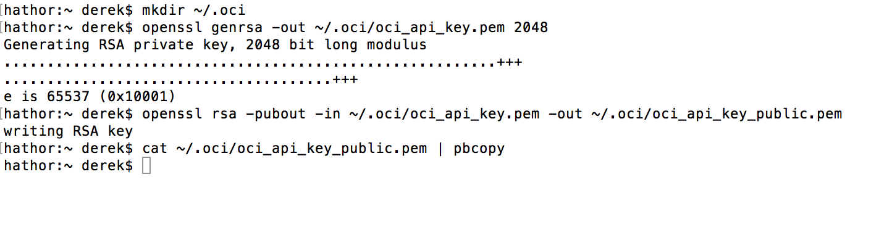

- In your browser window showing the OCI Console, click the **hamburger icon** to open the navigation menu. Under the **Identity** section, click **Users**. Find the user called **api.user**, or for a trial account, find **your username** in the list and hover over the **three dots** menu at the far right of the row, then click **View User Details**.

  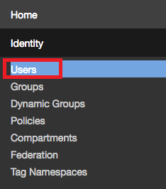

  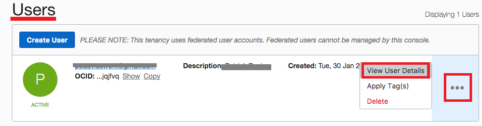

  **NOTE**: You may not see any users in the list, or there may be only administrator users that you cannot modify. In that case, you can access your current logged-in user settings by hovering over your username in the top right of the page and clicking **User Settings**.

    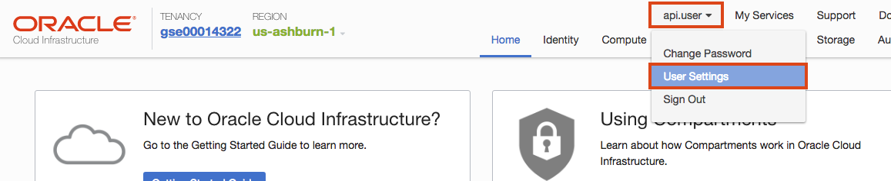

- Click **Add Public Key**

  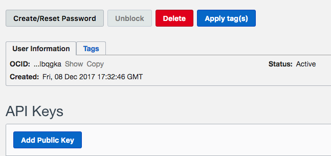

- **Paste** the public key from your clipboard into the text field and click **Add**. Note: The public key was copied to the clipboard when you ran the `cat` command from the terminal window, which copied the results to the clipboard using the `clip` command.

  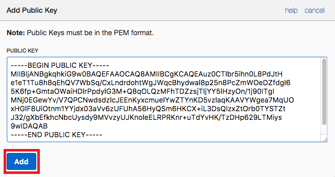

- **Leave this browser window open**, as we will need to copy and paste some of this information into the Terraform configuration file. -->
