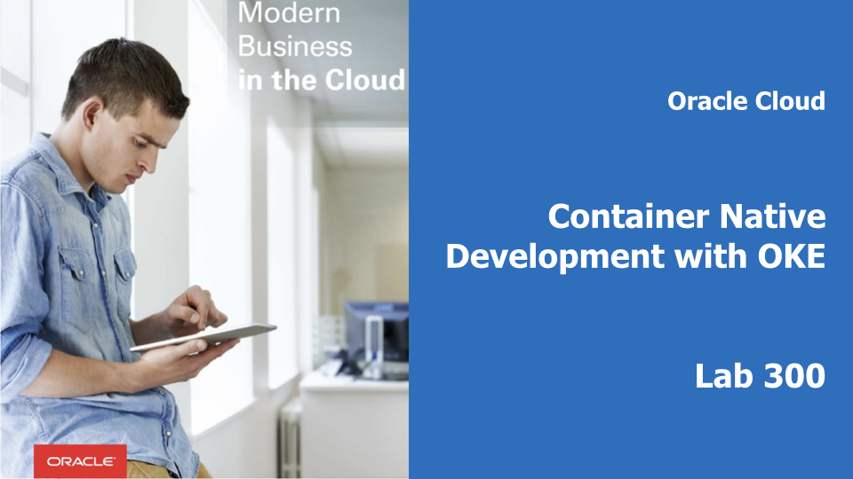
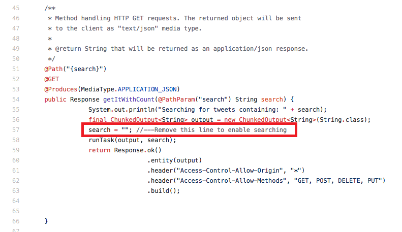
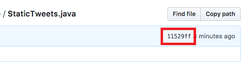
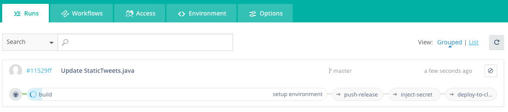
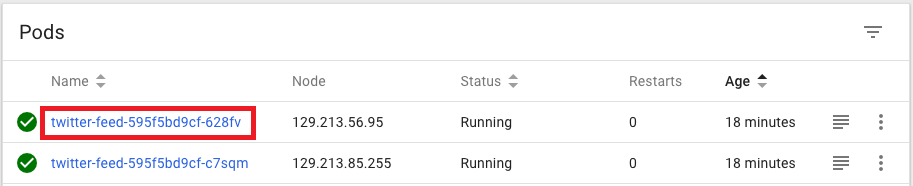
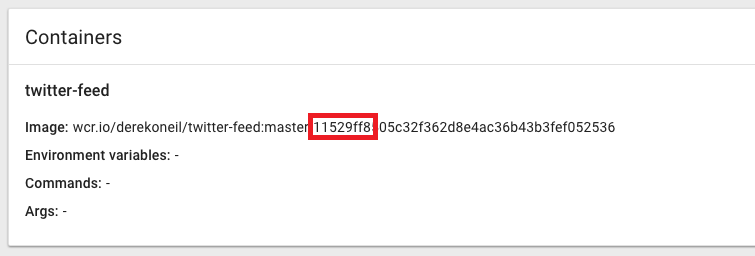
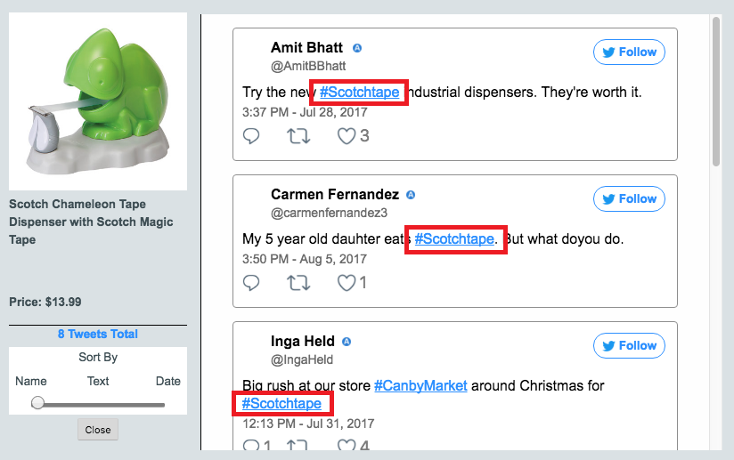

# Make a Bug Fix to Your Java Microservice

## Introduction

This is the third of several labs that are part of the **Oracle Public Cloud Container Native Development workshop.** This workshop will walk you through the process of moving an existing application into a containerized CI/CD pipeline and deploying it to a Kubernetes cluster in the Oracle Public Cloud.

You will take on 2 personas during the workshop. The **Lead Developer Persona** will be responsible for configuring the parts of the automated build and deploy process that involve details about the application itself. The **DevOps Engineer Persona** will configure the parts of the automation involving the Kubernetes infrastructure. To containerize and automate the building and deploying of this application you will make use of Wercker Pipelines for CI/CD, OCI Registry for a container registry, and OCI Container Engine for Kubernetes for provisioning a Kubernetes cluster on Oracle Cloud Infrastructure.

During this lab, you will take on the **Lead Developer Persona** and work on fixing a bug found in Java microservice that you deployed to Kubernetes in the previous lab. You will make a code change that fixes the bug, commit the code to GitHub, and observe the execution of the build and deploy workflow that is managing your application. Then you'll test the application to verify that the bug fix was successful.

**_To log issues_**, click here to go to the [GitHub oracle](https://github.com/oracle/learning-library/issues/new) repository issue submission form.

## Objectives

**Make a Bug Fix to Your Java Microservice**

- Modify Java Code and Commit to GitHub
- Verify Execution of Wercker Workflow
- Verify Deployment to Kubernetes
- Test the Product Catalog Application

## Required Artifacts

- The following lab requires:
  - an Oracle Cloud Trial Account
  - a [GitHub account](https://github.com/join)

# Make a Bug Fix to Your Java Microservice

## Fix Java Microservice

### **STEP 1**: Modify Java code and commit to GitHub

- Open **[Wercker](https://app.wercker.com)** in a new tab or browser window, or switch to it if you already have it open. In the top navigation bar, click **Pipelines**, then click on your **twitter-feed-oke** application.

  

- In a new browser tab, navigate to your forked twitter-feed repository on GitHub. If you've closed the tab, you can get back by going to [GitHub](https://github.com/), scrolling down until you see the **Your repositories** box on the right side of the page, and clicking the **twitter-feed-oke** link.

  

- Click the **Find file** button.

  

- Type **statictweets** in the search bar, then click on **StaticTweets.java** to open the file.

  

- Click the **pencil button** to begin editing the file.

  

- Scroll down to approximately **line 57**. This is the REST endpoint that should return only tweets that match a given search term, but it's not working. Delete **line 57** to fix the bug that is breaking this feature.

  

- Scroll to the bottom of the page and click **Commit changes**.

  

- Take note of the **Git commit hash** displayed in the latest commit banner above the source code. We will use it to verify the version of code running in our Kubernetes cluster.

  

### **STEP 2**: Verify Execution of Wercker Workflow

- Switch to your **Wercker** browser tab. You will see that the workflow execution is already in progress, having been triggered by a webhook when you committed your code change. Wait for the **deploy-to-cluster** pipeline to begin executing.

  

- In a new browser tab, navigate to the **Kubernetes dashboard** at [**Kubernetes dashboard**](http://localhost:8001/api/v1/namespaces/kube-system/services/https:kubernetes-dashboard:/proxy/). Click on **Overview** in the left side navigation menu. You should see two new twitter-feed pods with a very small `Age` (a few seconds to a few minutes, depending on how much time has elapsed between the end of the Workflow execution and now). If you get to the dashboard very quickly after the Workflow finishes, you may see the two old pods from the previous lab being terminated, as in the screenshot below. **The old pods will be removed** from the UI within a minute of the new pods being started.

  

- We have seen that Kubernetes has started up some new pods, but we still want to verify exactly which code version is running in those pods. That's where the Git commit hash comes in. We are naming our Docker image with the Git branch name and commit hash, so we can trace the running application back to the commit that triggered its deployment. Click on either of the two new running **twitter-feed pods** to view the detail page.

  

- In the **Containers** section, note the Git branch (master) and commit hash at the end of the **image** field. Compare the commit hash to the one displayed by GitHub that you noted in the previous step. They should match, confirming that the latest code version is currently running in Kubernetes.

  

### **STEP 3**: Validate Product Catalog application functionality

- Still in the Kubernetes dashboard, click **Services** from the left side navigation menu. Then click the **External endpoint URL** for the **product-catalog-service**.

  

- The Alpha Office Product Catalog site will load in a new tab. Click on **any of the products** to load its twitter feed. Now the feed displays only tweets with hashtags relevant to this specific product. We've gone from making a code change to having our new version built, tested, and deployed to Kubernetes in just a couple of minutes!

  

**You are now ready to move to the next lab: [Lab 400](LabGuide400.md)**
