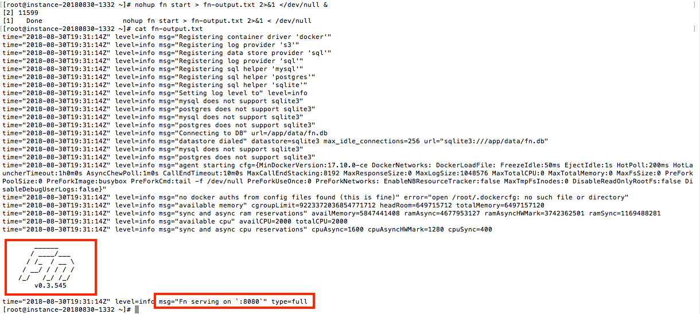
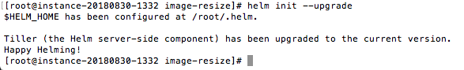
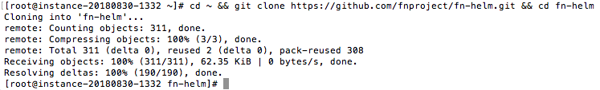
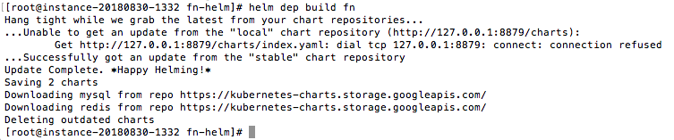
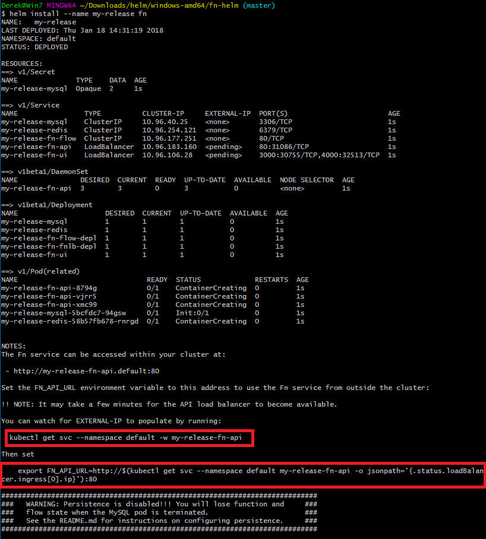
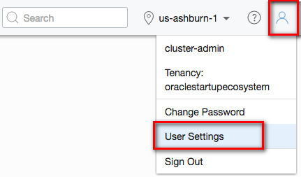

  

## Introduction

This is the fifth lab that is part of the **Oracle Public Cloud Container Native Development workshop.** This workshop will walk you through the process of moving an existing application into a containerized CI/CD pipeline and deploying it to a Kubernetes cluster in the Oracle Public Cloud.

You will take on 2 personas during the workshop. The **Lead Developer Persona** will be responsible for configuring the parts of the automated build and deploy process that involve details about the application itself. The **DevOps Engineer Persona** will configure the parts of the automation involving the Kubernetes infrastructure. To containerize and automate the building and deploying of this application you will make use of Wercker Pipelines for CI/CD, OCI Registry for a container registry, and OCI Container Engine for Kubernetes for provisioning a Kubernetes cluster on Oracle Cloud Infrastructure.

During this lab, you will take on the **Lead Developer Persona** and extend your application using a serverless function. You will install an Fn Server on your Kubernetes cluster, download your function code from GitHub, try out your function locally, deploy your function to the Fn Server on Kubernetes, and test it in the product catalog application.

**_To log issues_**, click here to go to the [GitHub oracle](https://github.com/oracle/learning-library/issues/new) repository issue submission form.

## Objectives

**Extend Your Application Using a Function**

- Run Your Function Locally
  - Install Fn Server on Your Virutal Machine
  - Clone the Function Repository
  - Deploy the Function Locally
  - Test the Function Using curl
- Deploy Your Function to Fn on Kubernetes
  - Install Helm on Your Local Machine
  - Deploy Fn Server to Kubernetes Using Helm
  - Deploy Your Function to Fn Server on Kubernetes
  - Test Your Function in the Product Catalog

## Required Artifacts
- The following lab requires:
  - an Oracle Public Cloud account that will be supplied by your instructor, or a Trial Account
  - a [GitHub account](https://github.com/join)

# Extend Your Application Using a Function

## Run Your Function Locally

### **STEP 1**: Install Fn Server on Your Virtual Machine

- We are going to use the virtual machine that you created in OCI as our local or development machine for Fn. Return to your **SSH session** either in PuTTY or your terminal window. If you have closed it, start a new one using the same method as you did in Lab 200 (e.g. `cd ~/container-workshop/ssh-keys; ssh -i ssh-key opc@<IP-Address-of-Your-VM>`);

  

- From this point forward, all command line instructions should be run _inside your SSH session_, not in a command prompt/shell on your local machine. Switch to the `root` user in your SSH session and install the prerequisite packages (and a few extras) by running:

  ```bash
  sudo su -
  yum -y install docker kubectl git caca-utils
  ```

  **NOTE**: Docker and kubectl are prerequisites of Fn. Git and caca-utils are used in this lab for downloading repositories from GitHub and displaying images in the terminal, respectively.

- Start Docker by running:

  ```bash
  systemctl start docker
  ```

- Now we're ready to install the Fn CLI onto our VM. Run:

  ```bash
  curl -LSs https://raw.githubusercontent.com/fnproject/cli/master/install | sh
  ```

- Great, that was easy. Let's start a local Fn Server in the background that we can use for development. From a terminal, run:

  ```bash
  nohup fn start > fn-output.txt 2>&1 </dev/null &
  cat fn-output.txt
  ```

  

- You should see the Fn logo printed to the console, as well as a message indicating the port that the Fn Server is using: `Fn serving on ':8080'`. This indicates that Fn server is started successfully. Let's test it. Run the following to see if we get the expected 'Hello: World' response from Fn:

  ```bash
  curl localhost:8080
  ```

  

- Looks good, let's move on to creating our first function.

### **STEP 2**: Clone the Function Repository

- Now we're ready to get a copy of the image resizing function and test it out on our local Fn Server. Clone the Git repository into your home directory using the following command.

  ```bash
  cd ~ && git clone https://github.com/derekoneil/image-resize.git && cd image-resize
  ```

  

**NOTE**: Functions deployed to Fn are packaged in Docker containers. You can use any programming language to write your functions, and you can deploy them to any Fn Server -- local, running on your server, or hosted in the cloud. The function you just cloned actually involves no code at all, it is simply a Dockerfile that installs and executes the open source command line tool ImageMagick. Using functions like this is a quick and easy way to convert open source or command line tools to auto-scaling web services.

### **STEP 3**: Deploy the Function Locally

- Now that you have the function 'code', you can deploy it to the local Fn Server you started earlier by running the following commands in your terminal window:

  ```bash
  fn migrate
  fn deploy --app imgconvert --local
  ```

  **NOTE**: The `--app imgconvert` tells Fn to create a new application named imgconvert and associate this function with it. In general, the application can be named anything you like, but by default the name will show up in the function URL. Since the product catalog application is expecting the app to be named `imgconvert`, don't alter the name.

  

### **STEP 4**: Test the Function Using curl

- With the function deployed to our local Fn Server, we can use **curl** to test it. Execute the following command while still in the image-resize directory:

  ```bash
  curl -X POST --data-binary @"sample-image.jpg" -H "Content-Type: application/octet-stream" http://localhost:8080/t/imgconvert/resize128 > thumbnail.jpg
  ```

  

- Since we are not using a graphical desktop, you may be wondering how we can make sure the returned image is really a valid image file at all. In the beginning of this lab you installed a package called `caca-utils`. Let's see what it can do:

  ```bash
  cacaview thumbnail.jpg
  ```

  

- Looks like an image alright! **Press q** to quit the viewer. Now that we've tested our function locally, it's time to set up a remote Fn Server on Kubernetes and deploy our function to the cloud.

## Deploy Your Function to Fn on Kubernetes

### **STEP 5**: Install Helm on Your Cloud VM

- Helm is a package manager for Kubernetes that streamlines installing and managing applications on your Kubernetes cluster. We'll use Helm in this lab to install Fn on our Kubernetes cluster. Run the following command to install the latest version:

  ```bash
  curl https://raw.githubusercontent.com/kubernetes/helm/master/scripts/get | bash
  ```

- Copy the `kubeconfig` file from the OPC user's home directory to root's home directory by running:

  ```bash
  cp -r /home/opc/.kube /root
  ```

- Run the following command to initialize **Helm**

  ```bash
  helm init --upgrade
  ```

  

### **STEP 6**: Deploy Fn Server to Kubernetes Using Helm

- Clone the **fn-helm git repository** using the following command.

  ```bash
  cd ~ && git clone https://github.com/fnproject/fn-helm.git && cd fn-helm
  ```

  

- Customize the chart with our preferred version of fn by running:

  ```bash
  sed -i.bak '/fnproject\/fnserver/{n;s/.*/  tag: 0.3.579/}' fn/values.yaml
  ```

- Update the readiness probe URL for v2 of the fn API by running:

  ```bash
  sed 's/\/v1\/apps/\/v2\/apps/' fn/templates/fn-daemonset.yaml
  ```

- Prepare the **dependencies** of the Fn chart by running:

  ```bash
  helm dep build fn
  ```

  

- Install the **Fn chart** by running the following command. **NOTE** _DO NOT_ change the name of the release, `my-release`. This name becomes part of the Kubernetes service name, which is used for DNS routing. If the name is changed, the product catalog application will not be able to communicate with the deployed function.

  ```bash
  helm install --name my-release fn
  ```

  

- As directed by the output of the install command, set the `FN_API_URL` environment variable by waiting for the load balancer to be provisioned and using its external IP address in the URL.

  - To check the status of the load balancer from the command line, run the following command. Note, you can use Ctrl-C to stop the command running, and re-run to again check if the External-IP field is populated:

    `kubectl get svc --namespace default -w my-release-fn-api`

    

  - Once the **External-IP** field is populated (which could take up to 5 minutes), set the **FN_API_URL** environment variable using the following command:

    ```bash
    export FN_API_URL=http://$(kubectl get svc --namespace default my-release-fn-api -o jsonpath='{.status.loadBalancer.ingress[0].ip}'):80
    ```

    

    **NOTE**: You can also find out the API URL from the [Kubernetes dashboard](). To check the status of the load balancer from the [Kubernetes dashboard](), click **Services** from the left side navigation menu and look at the **External endpoints** column of the **my-release-fn-api** service.   

    

  - Verify that the environment variable was set correctly by running the following command. Note that your IP address will differ from the screenshot.

    `echo $FN_API_URL`

    

### **STEP 7**: Deploy Your Function to Fn Server on Kubernetes

- In your SSH session, change directories to cloned function directory from **STEP 2**.

  ```bash
  cd ~/image-resize
  ```

  

- Since we are pushing to a remote Fn Server, Fn will use Oracle's Docker registry, OCIR, as the container registry. We need to set the FN_REGISTRY environment variable to tell Fn which Docker Hub user to push to. In the following command, **replace "<your-tenancy-name\>"** with the name of your Oracle Cloud tenancy, found under the User menu in the OCI Console:

  

  ```bash
  export FN_REGISTRY=iad.ocir.io/<your-tenancy-name>
  ```

  

- In order to push our function Docker image into our OCI Registry, we will need to log in using the Docker CLI. The password we use to authenticate is an **OCI Auth Token**, just as we created for Wercker in Lab 200. Navigate to the **OCI Console** in a web browser on your local machine. Open your **User Settings** page by selecting User Settings from the user menu in the top right corner.

    

- In the Resources menu of the user settings page, click **Auth Tokens**. Then click **Generate Token**.

  

  

- In the Description field, enter **Docker** and click **Generate Token**.

  

- The token is displayed in the dialog box. Leave it open, you will copy it in the next instruction.

    

- In your _SSH session_, run the following command, **substituting your OCI tenancy name** for "<your-tenancy-name\>":

  ```bash
  docker login -u <your-tenancy-name>/cluster-admin iad.ocir.io
  ```

- You will be prompted for your registry password. Click the **Copy** link from the OCI Console browser window displaying your newly-generated Auth Token. Then **paste** the token into the password prompt in your SSH session and press enter.

  

- Now we're ready to **Deploy the function** (and application) to the remote Fn Server using the same command you used in **STEP 3**, but without the --local flag.

  ```bash
  fn deploy --app imgconvert
  ```

  

- Test the function using **curl**, but this time using the URL of the remote Fn Server:

  ```bash
  curl -X POST --data-binary @"sample-image.jpg" -H "Content-Type: application/octet-stream" $FN_API_URL/t/imgconvert/resize128 > thumbnail-remote.jpg
  ```

  

- Open **thumbnail-remote.jpg** (using the same method you used in the local test) to verify the function was successful (and then **press q** to exit the viewer):

  ```bash
  cacaview thumbnail-remote.jpg
  ```

  

- Our function is deployed and available on our remote Fn Server, which is running in our Kubernetes cluster. The last thing to verify is that the product catalog application is able to find and use our function. Let's test out the upload image feature.

### **STEP 8**: Test Your Function in the Product Catalog

- Open the **product catalog** website in a browser _on your local machine_. If you don't have the URL, you can look in the Kubernetes dashboard for the **external endpoint** of the product-catalog-service, or you can run the following command from your SSH session:

  ```bash
  echo http://$(kubectl get svc --namespace default product-catalog-service -o jsonpath='{.status.loadBalancer.ingress[0].ip}'):$(kubectl get svc --namespace default product-catalog-service -o jsonpath='{.spec.ports[0].port}')
  ```

  

- Click any of the **product images** to open the detail view.

  

- In the **Upload an image** pane, click **Choose file**. Select any JPG or PNG image from your machine (or [load the sample image](https://github.com/derekoneil/image-resize/raw/master/sample-image.jpg), right click, and choose 'Save Image As' first) and click **open**.

  

- You'll see a loading spinner in the upload pane while your browser uploads the full size image to the product catalog server. The product catalog server invokes your function (resolved using Kubernetes DNS service at the URL `http://my-release-fn-api/t/imgconvert/resize128`). The thumbnail is returned to the product catalog server, which passes it back to your browser to be displayed. If everything worked correctly, you'll see the generated thumbnail displayed in the upload pane.

  

- Congratulations! You've just used the Fn Project to create and deploy a new serverless function to extend your application!

**You have completed the Container Native Application Development Workshop**
