# Cleaning Up After the Workshop

## Introduction

Now that you have completed the workshop, you may want to remove the artifacts left behind in your Oracle Cloud trial account. This guide will show you how to remove everything that you created during the workshop. Note that compute instances and load balancers left running in your Oracle Cloud trial account will continue to consume trial credits until they are terminated.

**_To log issues_**, click here to go to the [GitHub oracle](https://github.com/oracle/learning-library/issues/new) repository issue submission form.

# Remove All Deployed and Installed Workshop Components

## Clean up Oracle Cloud Account

### **STEP 1**: Delete Kubernetes Services

- First we need to delete any load balancers created by Kubernetes outside of the Terraform infrastructure we provisioned. Open an **SSH session** to your cloud VM as documented in Lab 200. _In the SSH session_, run the following command (you may need to switch to `root`):

  `kubectl delete svc --all`

### **STEP 2**: Delete VM Instance

- As documented in the other labs, connect into your Oracle Cloud Account, and go to the OCI Console.

- In the OCI Console, select **Compute > Images** from the navigation menu

  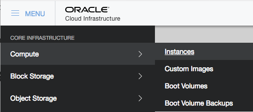

- We will now delete the instance created during the Workshop. Hover over the **three dots** to the right of the VM instance, then select **Terminate**

  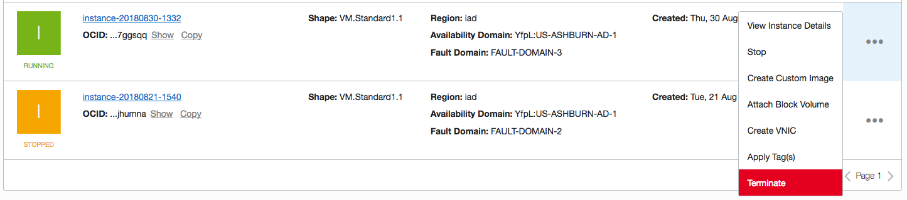

- Ensure the **Permanently delete** box is checked, and click on **Terminate Instance**.

  

### **STEP 3**: Delete Kubernetes Cluster

- Log in to the OCI Console as `cluster-admin`.

- From the navigation menu, select **Developer Services -> Container Clusters (OKE)**

  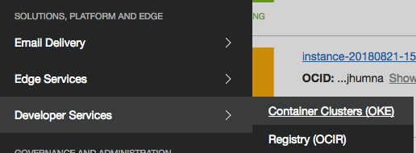

- Click the name of your cluster in the table to view the details page. Then click **Delete Cluster**

  

-  On the confirmation dialog, click **Delete**

  

- You will see the cluster change status to **Deleting**.

  

- Eventually, the worker nodes will be terminated and the cluster status will change to **Deleted**

  

  

### **STEP 4**: Delete the API Key Fingerprint and Auth Tokens

- In the user menu in the top right corner, select **User Settings**

- From the **API Key** section, click on the **Delete** button to the right of the **Fingerprint** you created during this workshop. Confirm the delete by clicking on **OK** in the popup dialog box.

  

- Click **Auth Tokens** in the left navigation pane.

  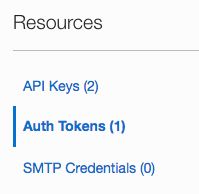

- In the **three dots** menu next to each of your tokens, click **Delete**

  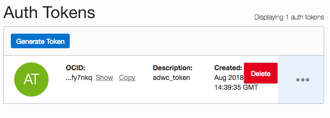

### **STEP 5**: Delete Images from Container Registry

  - Log in to the OCI Console as `cluster-admin`.

  - From the navigation menu, select **Developer Services -> Registry (OCIR)**

  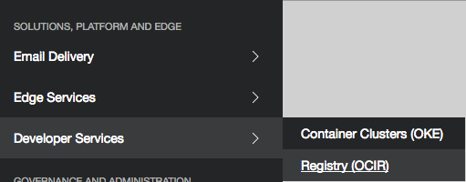

  - Click the **twitter-feed** repository.

  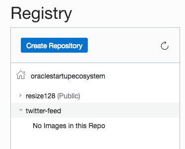

  - From the Actions menu, select **Delete Repository**

  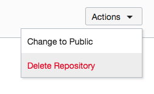

  - In the confirmation dialog, click **Delete**

  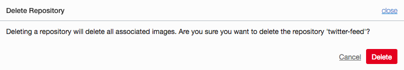

  - Repeat the last three instructions to delete the repository **resize128**.

### **STEP 6**: Delete Cluster-Admin User

- In the OCI Console navigation menu, select **Identity -> Groups**

  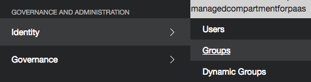

- Click **Administrators**

  

- In the **three dots** menu for `cluster-admin`, select **Remove Member From Group**

  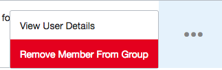

- In the OCI Console navigation menu, select **Identity -> Users**

  

- In the **three dots** menu for the `cluster-admin` user, click **Delete**

  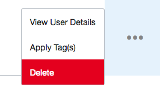

- In the confirmation dialog, click **OK**

  

### **STEP 7**: Remove OKE Policy statement

- In the OCI Console navigation menu, select **Identity -> Policies**

  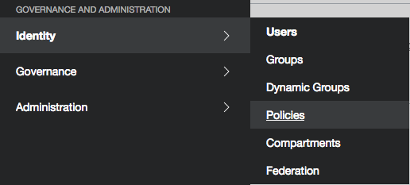

- Using the compartment drop down list, switch to the **root compartment**.

  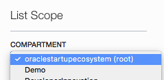

- Click **PSM-root-policy**

  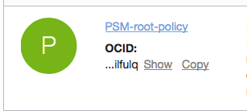

- Find the statement `allow service oke to manage all-resources in tenancy`. In the **three dots** menu for that statement, select **Delete**

  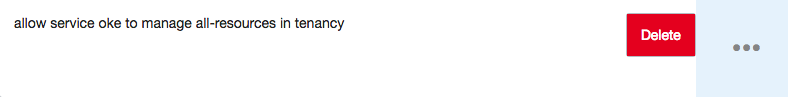

- In the confirmation dialog, click **OK**

  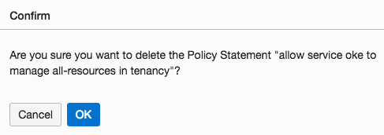

### **STEP 8**: (Optional) Delete Wercker Application

- Navigate to the **twitter-feed-oke** application on [app.wercker.com](app.wercker.com)

- Click the **Options** tab

  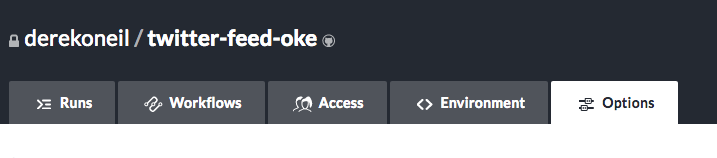

- Scroll to the bottom of the options page and click **Delete Application**

  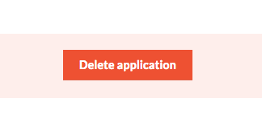

### **STEP 9**: (Optional) Delete twitter-feed-oke Fork on GitHub

- Navigate to your **twitter-feed-oke fork** on [GitHub](github.com) and click the **Settings tab**

  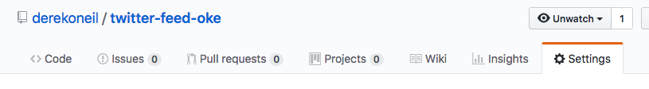

- Scroll all the way down and click **Delete this repository**

  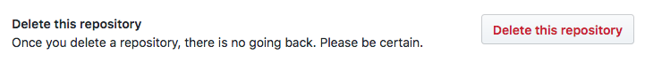
