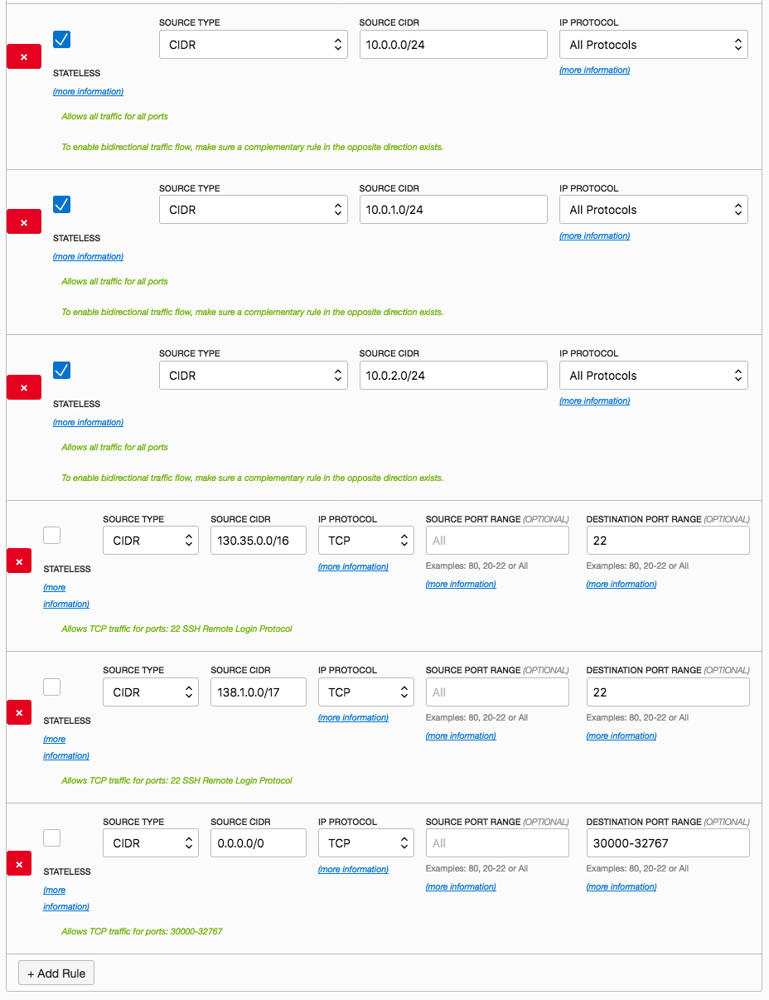
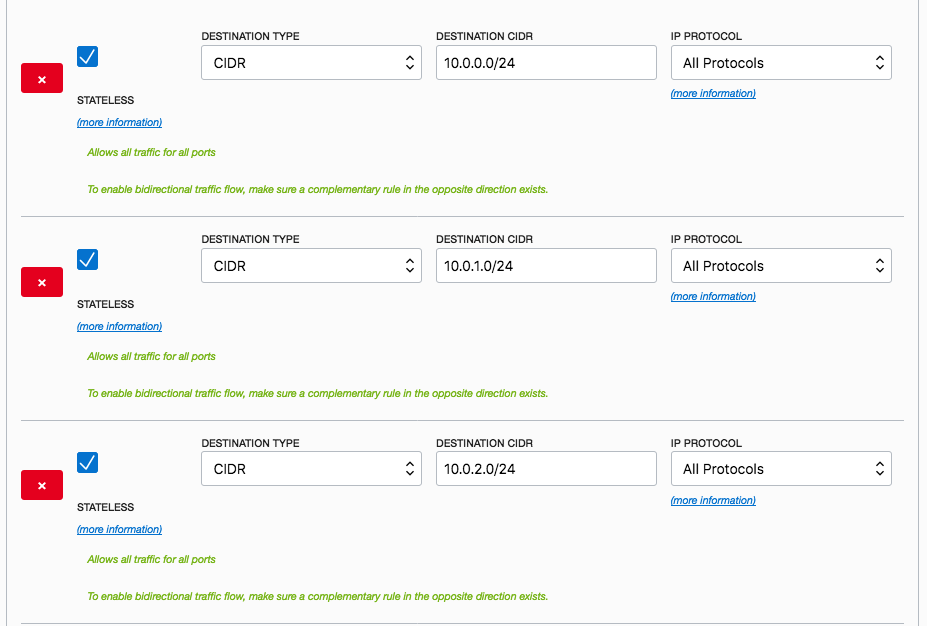
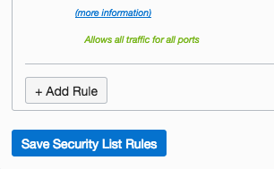
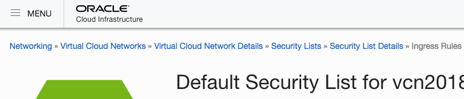
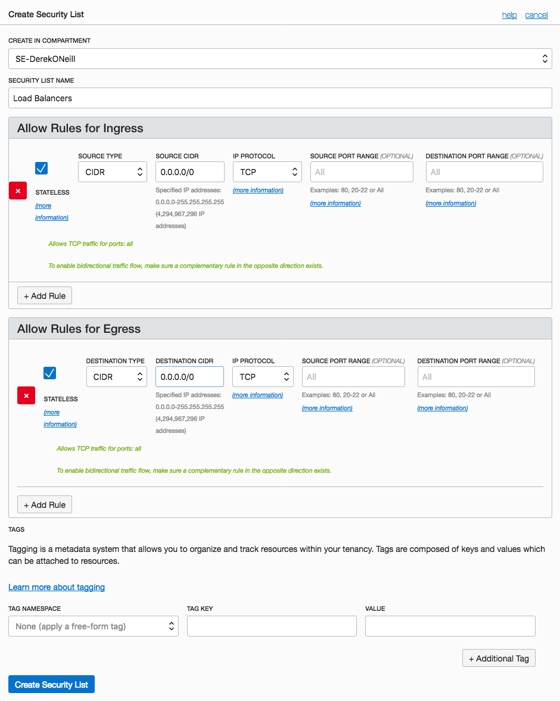
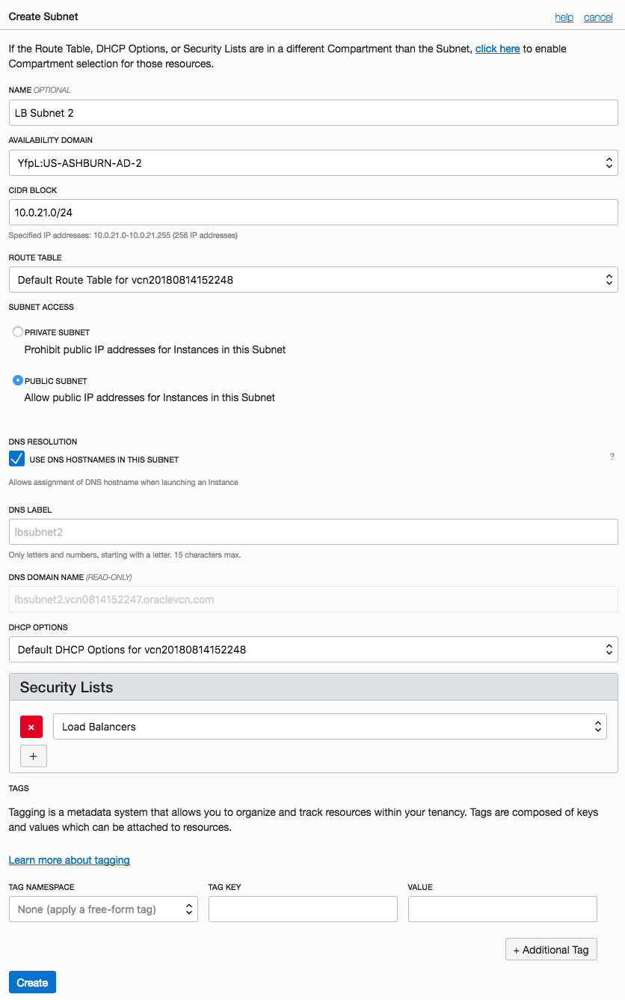

# Network Security Best Practices

## Introduction

In Lab 200, you were instructed to configure a Virtual Cloud Network with very permissive security list rules that allowed all traffic in and out of the subnet used for the Kubernetes worker nodes. This is not a good practice for production and production-like environments, as it increases the exposure of your Kubernetes workers to external attacks. The instructions in this guide detail an alternative network configuration for OKE that is much more restrictive, providing the appropriate level of network security for a Kubernetes environment on OKE.

## Network Configuration Steps

Instead of using one of the three `Public Subnet xxxx:yyyy-AD#` subnets for Kubernetes worker nodes and the other two as load balancer subnets (as we did in Lab 200), in this guide we will use all three `Public Subnet...` default subnets for worker nodes. This will provide us region-level high availability, as we will be able to put worker nodes in each availability domain. It will also allow us to create a different security list for worker nodes and load balancers, which will allow us to be more restrictive with the rules.

At the point in Lab 200 where you configure the permissive security list rules, you could alternatively have done the following steps to configure a more secure Virtual Cloud Network:

  - You will add 6 ingress rules and 3 egress rules to this security list. Use the **Add Rule** button to insert a new row each time. When you are finished, click **Save Security List Rules**

    **Rules for Ingress**

      - Stateless: **checked**. Source CIDR **10.0.0.0/24**. IP Protocol: **All Protocols**

      - Stateless: **checked**. Source CIDR **10.0.1.0/24**. IP Protocol: **All Protocols**

      - Stateless: **checked**. Source CIDR **10.0.2.0/24**. IP Protocol: **All Protocols**

      - Stateless: **checked**. Source CIDR **10.0.20.0/24**. IP Protocol: **All Protocols**

      - Stateless: **checked**. Source CIDR **10.0.21.0/24**. IP Protocol: **All Protocols**

      - Stateless: **unchecked**. Source CIDR **130.35.0.0/16**. IP Protocol: **TCP**. Destination Port Range: **22**.

      - Stateless: **unchecked**. Source CIDR **138.1.0.0/17**. IP Protocol: **TCP**. Destination Port Range: **22**.

      - Stateless: **unchecked**. Source CIDR **0.0.0.0/0**. IP Protocol: **TCP** Destination Port Range: **30000-32767**.

      

      

    **Rules for Egress**

      - Stateless: **checked**. Source CIDR **10.0.0.0/24**. IP Protocol: **All Protocols**

      - Stateless: **checked**. Source CIDR **10.0.1.0/24**. IP Protocol: **All Protocols**

      - Stateless: **checked**. Source CIDR **10.0.2.0/24**. IP Protocol: **All Protocols**

      - Stateless: **checked**. Source CIDR **10.0.20.0/24**. IP Protocol: **All Protocols**

      - Stateless: **checked**. Source CIDR **10.0.21.0/24**. IP Protocol: **All Protocols**

      

      

      

  - Now we need to create a new security list which will apply to our load balancers. Click **Security Lists** in the breadcrumbs at the top of the page, then click **Create Security List**.

    
    

  - Name the security list **Load Balancers** and create the following rules. When finished, click **Create Security List**

    **Rules for Ingress**

      - Stateless: **checked**. Source CIDR **0.0.0.0/0**. IP Protocol: **TCP**.

    **Rules for Egress**

      - Stateless: **checked**. Source CIDR **0.0.0.0/0**. IP Protocol: **TCP**

      

  - Our final task in setting up the network is to create two new subnets for our load balancers. In the left side navigation pane, click **Subnets**, then click **Create Subnet**

    
    

  - Fill out the Create Subnet form using the following selections. When finished, click **Create**
    - Name: **LB Subnet 1**
    - Availability Domain: xxxx:US-YYYY-**_AD-1_**
    - CIDR Block: **10.0.20.0/24**
    - Route Table: **Default Route Table for vcn201...**
    - DHCP Options: **Default DHCP Options for vcn201...**
    - Security Lists: **Load Balancers**

    

  - Now create a second load balancer subnet by clicking **Create Subnet** again. You will fill out the form in a very similar way, just changing the name, availability domain, and CIDR block. When finished, click **Create**
    - Name: **LB Subnet 2**
    - Availability Domain: xxxx:US-YYYY-**_AD-2_**
    - CIDR Block: **10.0.21.0/24**
    - Route Table: **Default Route Table for vcn201...**
    - DHCP Options: **Default DHCP Options for vcn201...**
    - Security Lists: **Load Balancers**

    

After following these steps, you will have 5 subnets:

  - `Public Subnet xxxx:yyyy-AD1`, `Public Subnet xxxx:yyyy-AD2`, and `Public Subnet xxxx:yyyy-AD3`: these subnets have a restrictive security list and will be used to provision highly available Kubernetes worker nodes

  - `LB Subnet 1` and `LB Subnet 2`: these subnets have permissive security lists and will be used to create load balancers for Kubernetes Services that require them.

When you provision a Kubernetes Cluster on OKE, you would select the two `LB Subnet #` subnets as the load balancer subnets and the three `Public Subnet xxxx:yyyy-AD#` subnets as the worker node subnets.

That's it! Following these steps, you would have both built-in high availability for your worker nodes and much tighter network security for your VCN.
