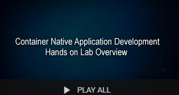

# Container Native Development with OKE Workshop

Welcome to the Oracle Public Cloud Container Native Development with OKE workshop. This workshop will walk you through the process of moving an existing application into a containerized CI/CD pipeline and deploying it to a managed Kubernetes service in the Oracle Public Cloud.
To learn more about this workshop please watch the video below.

### **Step 1**: Acquire an Oracle Cloud Trial or Workshop Account

- The Lab documentation is **best viewed** by using the Workshop's [GitHub Pages site](https://oracle.github.io/learning-library/workshops/container-native-development-with-oke/).

- Bookmark this page for future reference.

- Please click on the following link to create your <a class="trial-link" href="https://myservices.us.oraclecloud.com/mycloud/signup?language=en&sourceType=:ex:tb:::RC_NAMK180826P00001:OKE_OCIR_HOL&SC=:ex:tb:::RC_NAMK180826P00001:OKE_OCIR_HOL&pcode=NAMK180826P00001" target="_trial">Free Account</a>, and complete all the required steps to get your free Oracle Cloud Trial Account. When you complete the registration process you'll receive a $300 credit that will enable you to complete the lab for free.  Additionally, you'll have 1000s of hours left over to continue to explore the Oracle Cloud.

  - Soon after requesting your trial you will receive the following email. _You may begin working on Lab 100 before you receive this email_, but you will not be able to start Lab 200 until you have received it.

  

### **Step 2**: Navigate to Lab 100

- You may proceed to [Lab 100](LabGuide100.md)

- _You can see a list of Lab Guides_ by clicking on the **Menu Icon** in the upper left corner of the browser window. You're now ready to continue with **Lab 100**.

  
