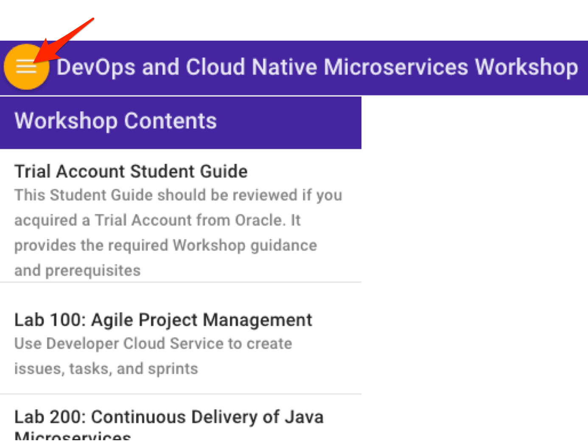

# Workshop Introduction

## How to prepare for this Workshop

- To log issues and view the Lab Guide source, go to the [github oracle](https://github.com/oracle/learning-library/issues/new) repository.

- Visit the [Workshop Interactive Labguide](https://launch.oracle.com/?container-native-development) for a visual overview of the workshop content.

## Container Native Application Development Workshop

Welcome to the Oracle Public Cloud Container Native Development workshop. This workshop will walk you through the process of moving an existing application into a containerized CI/CD pipeline and deploying it to a managed Kubernetes service in the Oracle Public Cloud.

You will take on 2 personas during the workshop. The Lead Developer Persona will be responsible for configuring the parts of the automated build and deploy process that involve details about the application itself. The DevOps Engineer Persona will configure the parts of the automation involving the Kubernetes infrastructure. To containerize and automate the building and deploying of this application you will make use of Wercker Pipelines, Oracle Container Registry, and Oracle Container Engine.

### **Step 1**: Acquire an Oracle Cloud Trial Account

- If you do not have a trial account please click on this URL [cloud.oracle.com/tryit](http://cloud.oracle.com/tryit&intcmp=DeveloperInnovation-HOL-11NOV17), and complete all the required steps to get your free Oracle Cloud Trial Account.

- You will eventually receive the following email. You may begin working on Lab 100 before you receive this email, but you will not be able to start Lab 200 until you have received it.

_Please note that this email may arrive in your spam or promotions folder pending your email settings._

- Once you receive it, click the **Get Started with Oracle Cloud** button to sign in using the temporary password found in the email. You will be prompted to change your password. During this process, please also provide answers to the **security questions** so that you will be able to reset your password if you cannot remember it.

### **Step 2**: Navigate to the Lab Guides

- _You can see a list of Lab Guides_ by clicking on the **Menu Icon** in the upper left corner of the browser window. You're now ready to continue with Lab 100.

  

## Lab Overview

### Lab 100: Containerize Your Java Microservice - Objectives

- Create Wercker Application
  - Fork Java Application on GitHub
  - Create a Wercker account
  - Create Wercker application
- Create and Run Wercker Pipelines
  - Configure Pipelines and Workflow in Wercker
  - Define Wercker Build Pipeline
  - Set Environment Variables in Wercker
  - Define Wercker Publish Pipeline
  - Validate Workflow Execution

### Lab 200: Automate Deployment to Kubernetes- Objectives

- Create and Deploy to a Kubernetes Cluster
  - Set Up Oralce Cloud infrastructure
  - Provision Kubernetes Using Terraform
  - Configure and Run Wercker Deployment Pipelines
  - Deploy and Test the Product Catalog Application

### Lab 300: Make a Bug Fix to Your Java Microservice - Objectives

- Make a Bug Fix to Your Java Microservice
  - Modify Java Code and Commit to GitHub
  - Verify Execution of Wercker Workflow
  - Verify Deployment to Kubernetes
  - Test the Product Catalog Application

### Lab 400: Kubernetes Blue/Green Deployments - Objectives

- Perform a Blue/Green Deployment to Kubernetes
  - Update Existing Deployment and Service with Blue Color Labels
  - Validate Deployment Color In Kubernetes and Application
  - Increment Application Version and Switch Color to Green
  - Validate Blue Deployment Still Serves Traffic
  - Reconfigure Service to Switch to Green Deployment
  - Validate Green Deployment Now Serves Traffic

### Lab 500: Extend Your Application with a Function - Objectives

- Run Your Function Locally
  - Install Fn Server on Your Local Machine
  - Clone the Function Repository
  - Deploy the Function Locally
  - Test the Function Using curl
- Deploy Your Function to Fn on Kubernetes
  - Install Helm on Your Local Machine
  - Deploy Fn Server to Kubernetes Using Helm
  - Deploy Your Function to Fn Server on Kubernetes
  - Test Your Function in the Product Catalog
