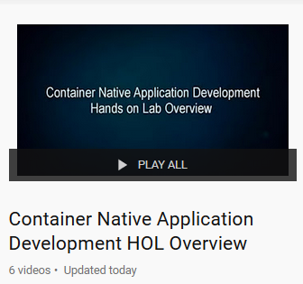

# Workshop Introduction

## Container Native Application Development Workshop

Welcome to the Oracle Public Cloud Container Native Development workshop. This workshop will walk you through the process of moving an existing application into a containerized CI/CD pipeline and deploying it to a managed Kubernetes service in the Oracle Public Cloud.

You will take on 2 personas during the workshop. The Lead Developer Persona will be responsible for configuring the parts of the automated build and deploy process that involve details about the application itself. The DevOps Engineer Persona will configure the parts of the automation involving the Kubernetes infrastructure. To containerize and automate the building and deploying of this application you will make use of Wercker Pipelines, Oracle Container Registry, and Oracle Container Engine.
As you go through this workshop you can watch recordings of the steps inside the lab at:

_Note: When clicking on links in this labguide_, it is best to **Right Click** on the link, and select **Open Link in New Tab**, as this will allow you to access the link without nagivating away from the Lab Guide. 

[You Tube Recordings](https://www.youtube.com/playlist?list=PLPIzp-E1msrarZljayc5JwyrYA2vqWZJ_)

### **Step 1**: Acquire an Oracle Cloud Trial Account

- If you do not have a trial account please click on this URL [cloud.oracle.com/tryit](http://cloud.oracle.com/tryit&intcmp=DeveloperInnovation-HOL-11NOV17), and complete all the required steps to get your free Oracle Cloud Trial Account.

- You will eventually receive the following email. _You may begin working on Lab 100 before you receive this email_, but you will not be able to start Lab 200 until you have received it.

### **Step 2**: Navigate to Lab 100

- _You can see a list of Lab Guides_ by clicking on the **Menu Icon** in the upper left corner of the browser window. You're now ready to continue with **Lab 100**.

  
