# Containerize Your Java Microservice


## Introduction

This is the first of several labs that are part of the **Oracle Public Cloud Container Native Development workshop.** This workshop will walk you through the process of moving an existing application into a containerized CI/CD pipeline and deploying it to a Kubernetes cluster in the Oracle Public Cloud.

You will take on 2 personas during the workshop. The **Lead Developer Persona** will be responsible for configuring the parts of the automated build and deploy process that involve details about the application itself. The **DevOps Engineer Persona** will configure the parts of the automation involving the Kubernetes infrastructure. To containerize and automate the building and deploying of this application you will make use of Wercker Pipelines for CI/CD, Docker Hub for a container registry, and Terraform for provisioning a Kubernetes cluster on Oracle Cloud Infrastructure.

During this lab, you will take on the **Lead Developer Persona** and work on containerizing your existing Java application. You will set up Wercker to monitor your application's source code repository for commits and automatically trigger a build, test, and package pipeline, which will result in a Docker image of your application that is ready to be deployed.

**_To log issues_**, click here to go to the [GitHub oracle](https://github.com/oracle/learning-library/issues/new) repository issue submission form.

## Objectives

**Containerize Your Java Application and Automate Building and Packaging**

- Create Wercker Application
  - Fork Java Application on GitHub
  - Create a Wercker account
  - Create Wercker application
- Create and Run Wercker Pipelines
  - Configure Pipelines and Workflow in Wercker
  - Define Wercker Build Pipeline
  - Set Environment Variables in Wercker
  - Create Docker Hub Repository
  - Define Wercker Publish Pipeline
  - Validate Workflow Execution

## Required Artifacts

- The following lab requires:
  - an Oracle Public Cloud account that will be supplied by your instructor, or a Trial Account
  - a [GitHub account](https://github.com/join)
  - a [Docker Hub account](https://hub.docker.com)

# Containerize Your Java Application and Automate Builds

## Create Wercker Application

### **STEP 1**: Fork Java Application on GitHub

- From any browser, go to:

    [https://github.com/derekoneil/twitter-feed](https://github.com/derekoneil/twitter-feed)

- Click **Fork** in the upper right hand corner of the browser. **Sign in** if prompted.

  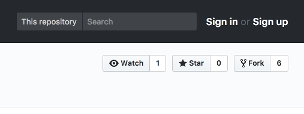

  **NOTE:** If prompted, choose to fork the repository to your account (this may occur if your account is also a member of an organization on GitHub).

### **STEP 2**: Create a Wercker account

  **NOTE** If you already have a Wercker account, proceed to **STEP 3**. If you have not associated your existing Wercker account with your GitHub account, you can do so in the **Settings->Git Connections** menu, found in the user dropdown in the top right corner of Wercker. 

- In a new browser tab, go to:
    [http://www.wercker.com/](http://www.wercker.com/)

- Click **Sign Up** in the upper right hand corner of the browser. Alternately, if you have already signed up for a Wercker account, click **log in** and then **log in with GitHub** and skip to **STEP 3**.

  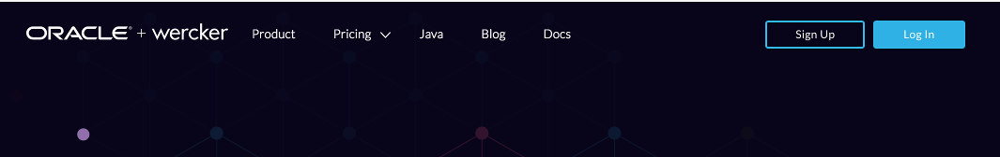

- Click **Sign Up Using GitHub**

  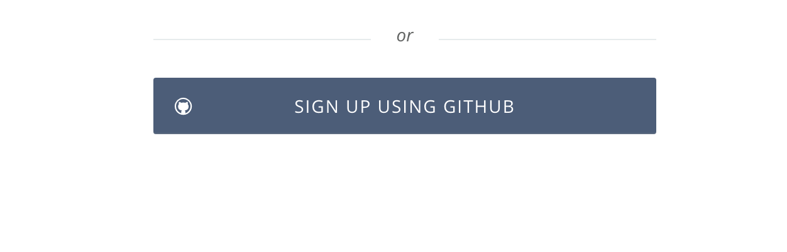

- Click the green **Authorize Wercker** button

  

- Enter **a username and your email address** to complete your Wercker account creation

  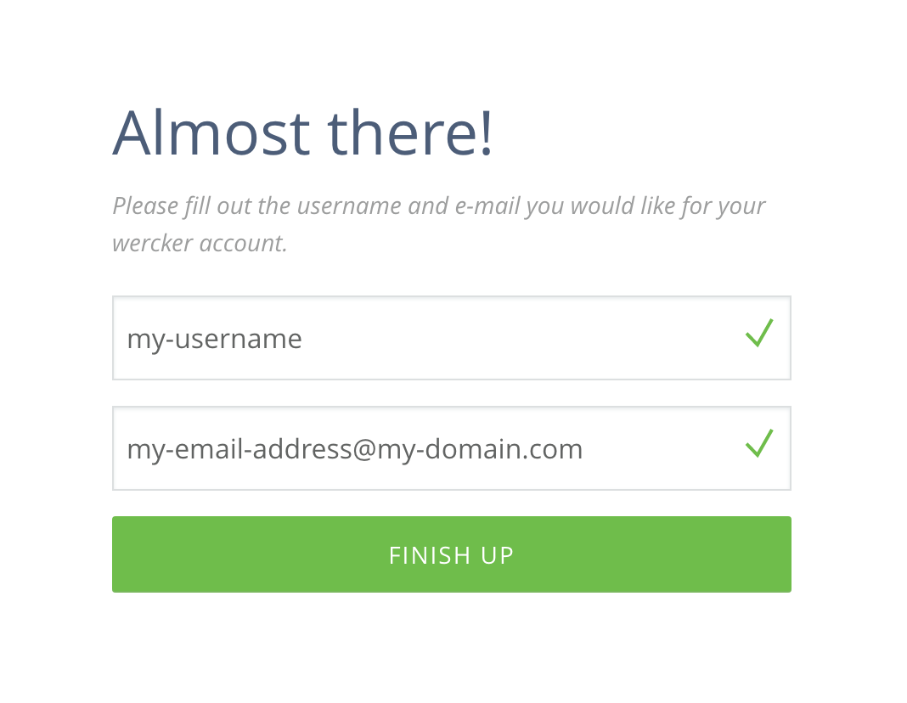

### **STEP 3**: Create a Wercker Application

- If this is your first Wercker application, click the blue **Create your first application** button. If you already have applications in your Wercker account, click the **plus button** in the upper right hand corner of the browser and select **Add application**:

  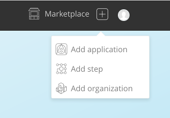


- Leave the default selections of **your account** for the owner and **GitHub** for the SCM and click **Next**

  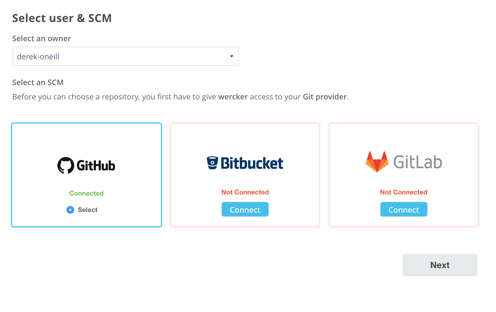

- Click on the **twitter-feed** repository that appears in the list of your GitHub repositories, then click **Next**

  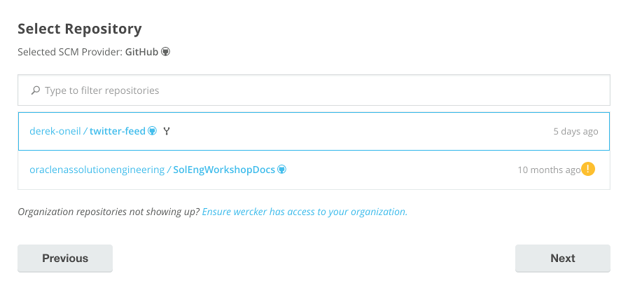

- Leave the default selection of checkout without an SSH key and click **Next**

  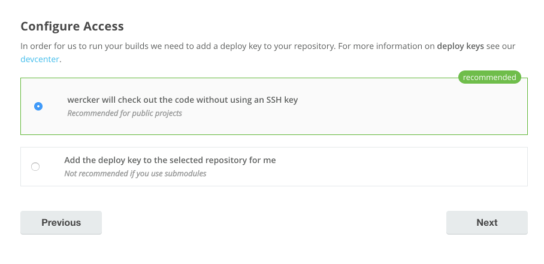

- Click **Create**

  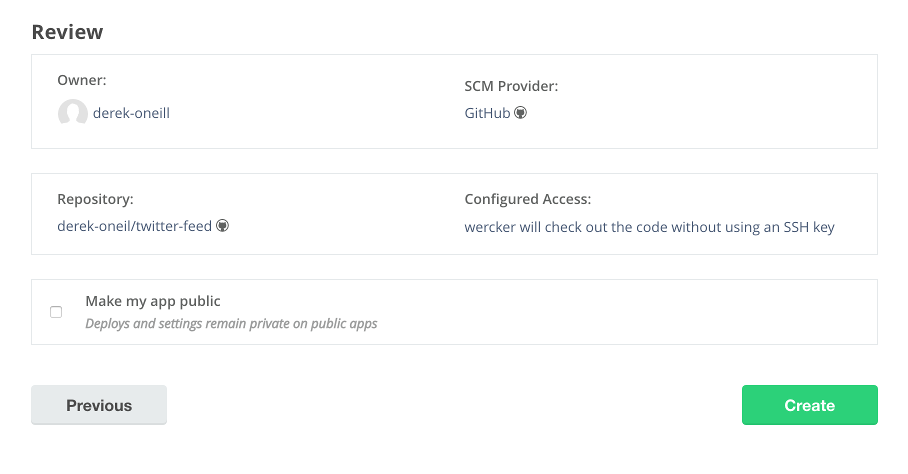

- Do not generate a wercker.yml file -- we will create one in a later step.

## Create and Run Wercker Pipelines

### **STEP 4**: Configure Pipelines and Workflow in Wercker

- Navigate to the Wercker page for your newly-created application (you will already be on that page if you just completed **STEP 3**). Notice that you are viewing the **Runs** tab. This is where any executions of your workflow will be recorded.

  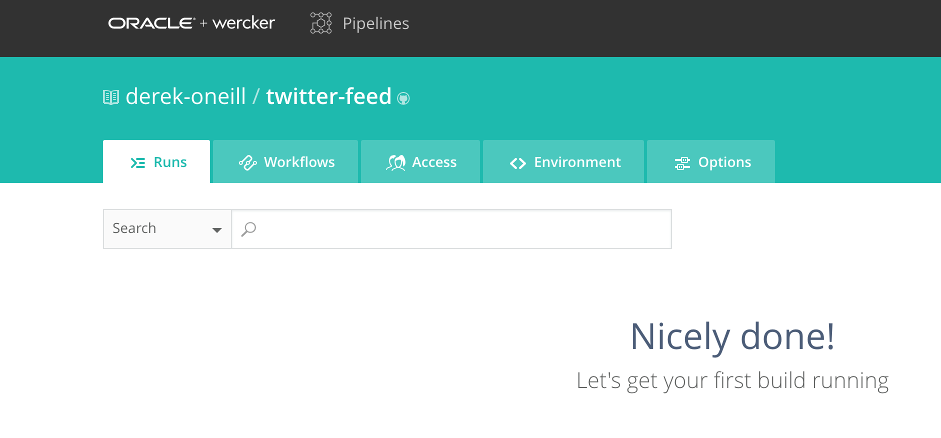

- Click the **Workflows** tab. You will see that Wercker has created the beginning of a workflow for you already. This workflow is triggered by a Git commit and it will execute a pipeline called **build**.

  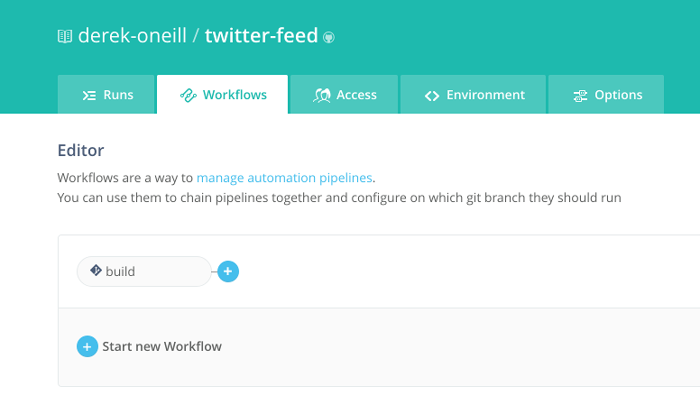

- The **build** pipeline will be used to build and unit test our application. Let's create a new pipeline to store the resulting Docker image in a Docker Hub repository. Click the **Add new pipeline** button.

  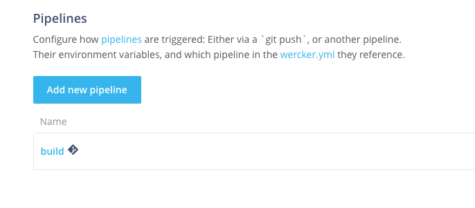

- Fill in `push-release` for the name of the pipeline and the YML name of the pipeline and click **Create**.

  

- Now that you've created the pipeline, click on the **Workflows** tab to return to the workflow editor. Click the **plus sign** next to the build pipeline in the editor.

  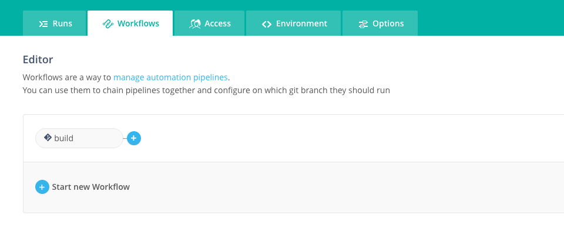

- In the **Execute Pipeline** drop down list, choose the pipeline we just created, **push-release**. Leave the other fields at their default values and click **Add**.

  

- Now that we've got a workflow configured that will build and store a Docker image containing our application, we need to define exactly how to do that in a file called **wercker.yml**, which we will store in our application's Git repository.

### **STEP 5**: Define Wercker Build Pipeline

- Switch back to your GitHub browser tab, showing your forked copy of the **twitter-feed** repository, and click **Create new file**

  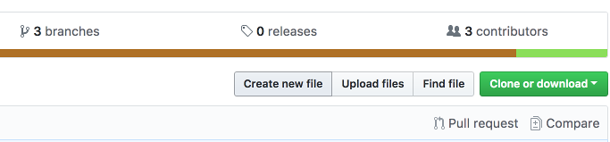

- In the **Name your file...** input field, type `wercker.yml`

  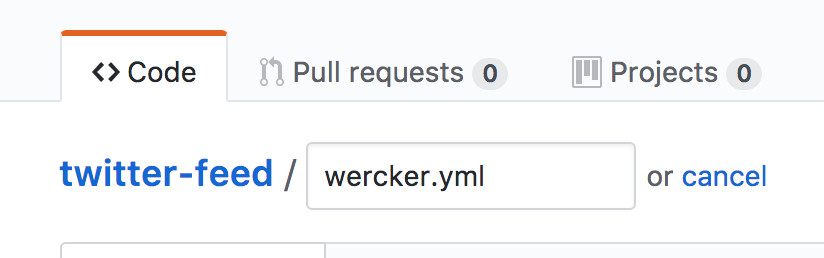

- In the **Edit new file** input box, **paste** the following:

```yaml
#Use OpenJDK base docker image from dockerhub and open the application port on the docker container
box:
  id: openjdk
  ports:
    - $PORT

#Build our application using Maven, just as we always have
build:
  steps:
    - install-packages:
        packages: maven
    - script:
        name: maven build
        code: mvn clean assembly:assembly
```

- You should have **14 lines** of YAML in the editor:

  

- Let's look at the two sections of YAML that we've just added. The first section describes a **box**. A **box** is the image that you want Wercker to pull from a Docker registry (the default is Docker Hub) to build your pipeline from. In our case, we need a Java environment to run our application, so we will pull the **openjdk** image from Docker Hub.

  The second section defines our first pipeline, the **build** pipeline. Our **build** pipeline consists of two **steps**, one to install any packages required for our build process (**install-packages**), and one to execute a shell command to invoke the build (**script**).

  Since our application is built using Maven, we will instruct Wercker to install the Maven package first, using the **install-packages** step. Then we'll build the application the same way we would normally, invoking Maven in the **script** step.

- At the bottom of the page, click the **Commit new file** button.

  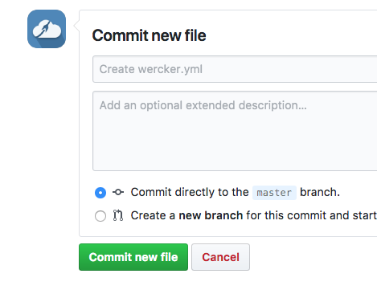

- Switch back to your **Wercker** browser tab and click on the **Runs** tab. If you are quick enough, you will see that Wercker has been notified of your new Git commit (via a webhook) and is executing your workflow.

  

- You should see that the **build** pipeline completes successfully, but the **push-release** pipeline fails. That's what we expected, since we have not yet defined the steps for the **push-release** pipeline in our wercker.yml file.

  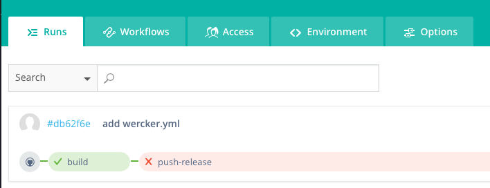

- Click on the green **build** pipeline to drill into the details of each step. Note that you can click on each step to see the console output produced by that step. In our case that output includes things like the results of the tests that Maven executed before packaging our application. If any commands produce an error status code, Wercker will abort the workflow and notify you via email.

  

- Our next step is to define the second part of our workflow, the **push-release** pipeline, which will store our container image in a Docker Hub repository after a successful **build**. This pipeline will make use of some environment variables, so let's get those set up first.

### **STEP 6**: Set Environment Variables in Wercker

- In your Wercker browser tab, click the **Environment** tab.

  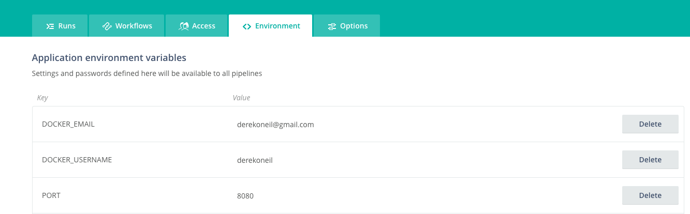

- Create an environment variable by filling in the **Key** and **Value** boxes and clicking **Add**. Repeat this step for each variable listed below.
  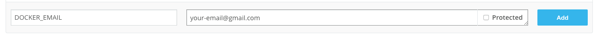

```
  Key:              Value:
  DOCKER_EMAIL      Your email address (can be any address)
  DOCKER_USERNAME   Your Docker Hub username
  DOCKER_PASSWORD   Your Docker Hub password (check the box for 'protected')
  DOCKER_REGISTRY   https://registry.hub.docker.com/v2
  DOCKER_REPO       your-docker-hub-username/twitter-feed
  PORT              8080
```

  

**NOTE**: The Docker email and username variables are required to authenticate to the container registry. The `DOCKER_REPO` must be **all lowercase**.

### **STEP 7**: Create Docker Hub Repository

- In a browser, go to [Docker Hub](https://hub.docker.com) and click on **Create Repository**.

  

  **OR**

    

- In the **Name** field, enter `twitter-feed`. Optionally add descriptions and click **Create**

  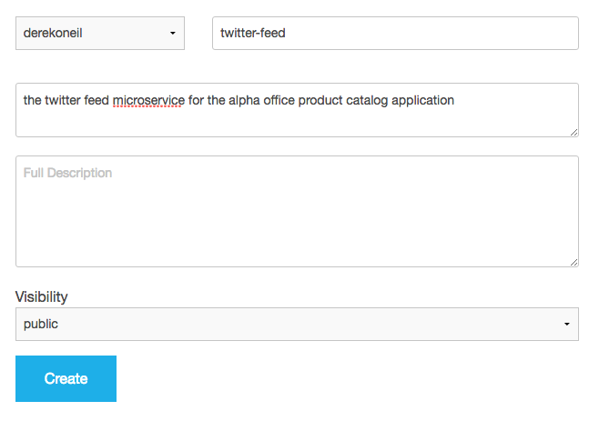

- Your repository is now ready for Wercker to push a Docker image into during the publish pipeline. Let's configure that now.

### **STEP 8**: Define Wercker Publish Pipeline

- Switch to your Github browser tab, click on the **wercker.yml** file, and click the **pencil icon** to begin editing.

  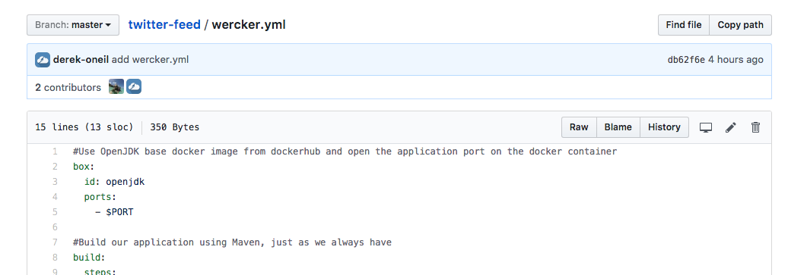

- After the definition of the build pipeline, **paste** the following YAML:

```yaml
#Push the docker image with our built and tested application to Docker Hub
push-release:
  steps:
    - internal/docker-push:
        username: $DOCKER_USERNAME
        password: $DOCKER_PASSWORD
        repository: $DOCKER_REPO
        registry: $DOCKER_REGISTRY
        tag: $WERCKER_GIT_BRANCH-$WERCKER_GIT_COMMIT
        working-dir: /pipeline/source
        ports: $PORT
        env: PORT=$PORT
        cmd: node server.js
```

  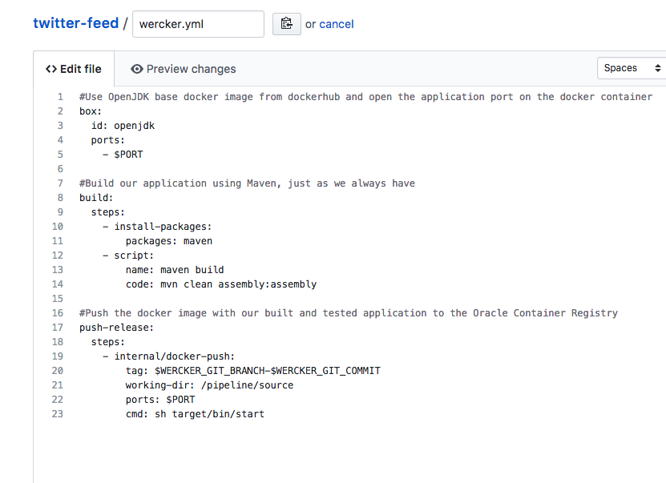

- This section of YAML defines our second pipeline, **push-release**. It uses a type of step we haven't seen before, **internal/docker-push**. This is a command developed by Wercker, which will take the current pipeline image and push it to a Docker registry. You can, however, use a different repository -- the step supports a `repository` parameter. You can find more info in the [documentation](http://devcenter.wercker.com/docs/steps/internal-steps#docker-push).

  There are two more things to note about this pipeline definition. First, the `cmd` parameter tells Docker how to start our application. Note that this is just the start script generated by Maven, exactly as we would have started it outside of Docker.

  Second, we have made use of several environment variables. We are tagging the release with the Git branch name and the Git commit hash so that we can trace our running application version back to a specific Git commit. These two variables (along with [others](http://devcenter.wercker.com/docs/environment-variables/available-env-vars#hs_cos_wrapper_name)) are automatically made available by Wercker. The `$PORT` environment variable, on the other hand, references the one that we defined ourselves in the previous step.

- At the bottom of the page, click **Commit changes**.

  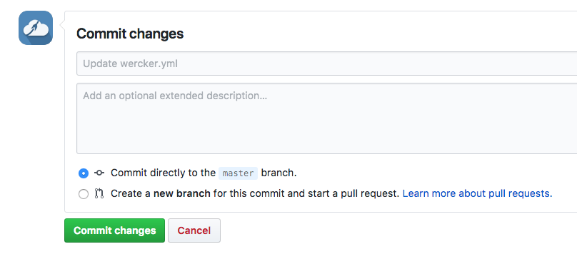

### **STEP 9**: Validate Workflow Execution

- Switch to your Wercker browser tab and click the **Runs** tab within Wercker. You'll see the workflow executing as a result of your Git commit.

  

- Once the workflow finishes, you'll see both the build and push-release pipelines turn green to indicate success. After that happens, switch back to your **Docker Hub** browser tab. You'll see that your twitter-feed repository was pushed to successfully (you may need to refresh the page).

  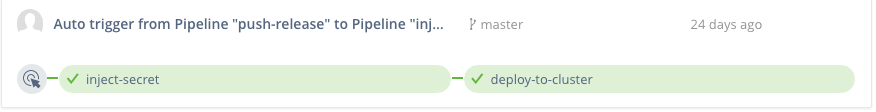

  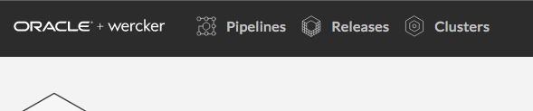

- Click the **Tags** tab to see the image metadata, such as the Git branch and commit hash, as well as the size of the image.

  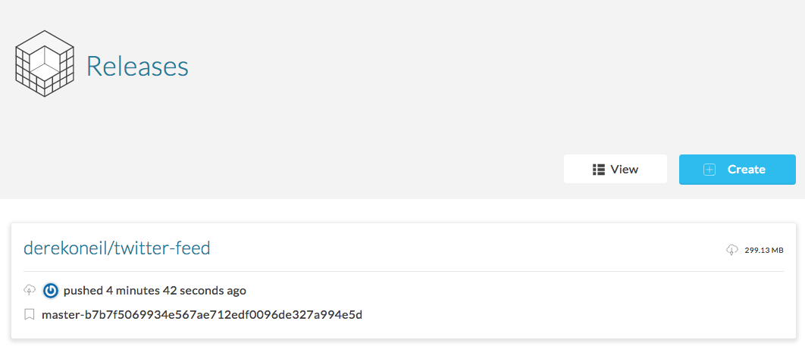

**You are now ready to move to the next lab.**
