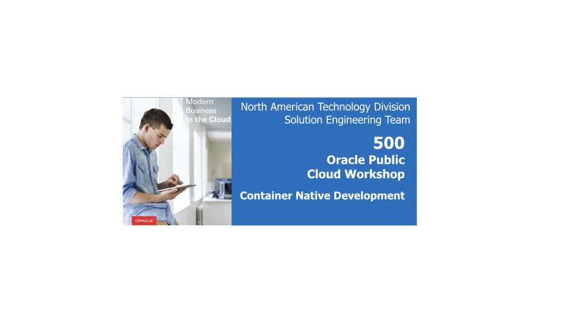  

## Introduction

This is the fifth lab that is part of the **Oracle Public Cloud Container Native Development workshop.** This workshop will walk you through the process of moving an existing application into a containerized CI/CD pipeline and deploying it to a Kubernetes cluster in the Oracle Public Cloud.

You will take on 2 personas during the workshop. The **Lead Developer Persona** will be responsible for configuring the parts of the automated build and deploy process that involve details about the application itself. The **DevOps Engineer Persona** will configure the parts of the automation involving the Kubernetes infrastructure. To containerize and automate the building and deploying of this application you will make use of Wercker Pipelines for CI/CD, Docker Hub for a container registry, and Terraform for provisioning a Kubernetes cluster on Oracle Cloud Infrastructure.

During this lab, you will take on the **Lead Developer Persona** and extend your application using a serverless function. You will install an Fn Server on your Kubernetes cluster, download your function code from GitHub, try out your function locally, deploy your function to the Fn Server on Kubernetes, and test it in the product catalog application.

**_To log issues_**, click here to go to the [GitHub oracle](https://github.com/oracle/learning-library/issues/new) repository issue submission form.

## Objectives

**Extend Your Application Using a Function**

- Run Your Function Locally
  - Install Fn Server on Your Local Machine
  - Clone the Function Repository
  - Deploy the Function Locally
  - Test the Function Using curl
- Deploy Your Function to Fn on Kubernetes
  - Install Helm on Your Local Machine
  - Deploy Fn Server to Kubernetes Using Helm
  - Deploy Your Function to Fn Server on Kubernetes
  - Test Your Function in the Product Catalog

## Required Artifacts
- The following lab requires:
  - an Oracle Public Cloud account that will be supplied by your instructor, or a Trial Account
  - a [GitHub account](https://github.com/join)
  - a [Docker Hub account](https://hub.docker.com/)

# Extend Your Application Using a Function

## Run Your Function Locally

### **STEP 1**: Install Fn Server on Your Local Machine

- Fn has one prerequisite--Docker--that we'll need to install before we begin (unless you already have it). From a browser, navigate to the [Docker CE download page](https://www.docker.com/community-edition). Download and run the installer and follow the prompts to **install Docker**. Be sure to log in with your Docker Hub account, either by clicking the Docker icon in the system tray or by running `docker login` from a terminal.

  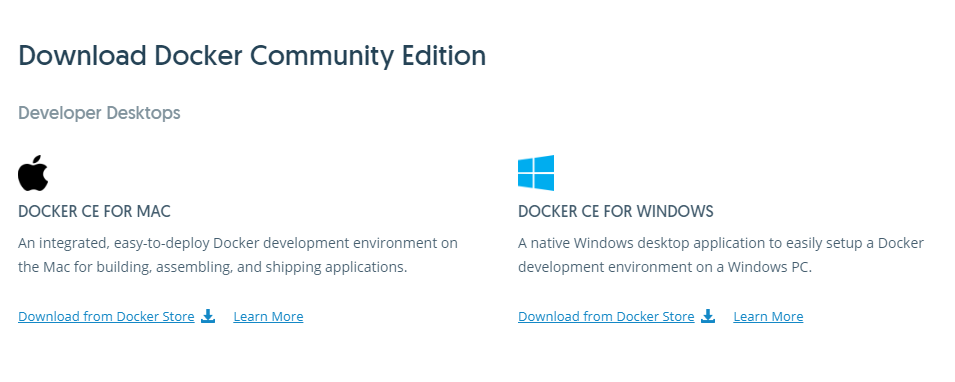

- Now that Docker is installed, we can download Fn. From a browser, navigate to the [Fn CLI releases GitHub page](https://github.com/fnproject/cli/releases/latest) and download the binary from the latest release that is appropriate for your operating system.

  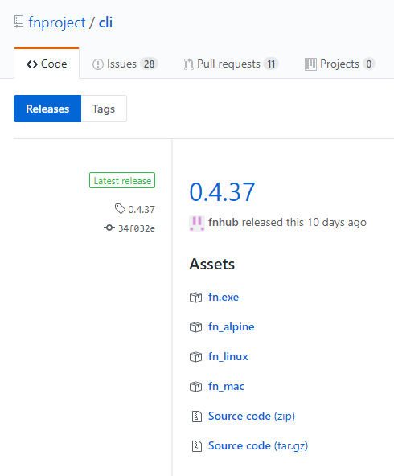

**NOTE**: See the [Fn Project Quickstart](https://github.com/fnproject/fn#quickstart) for more details on installation.

- Let's start a local Fn Server. From a terminal, run `fn start`.

  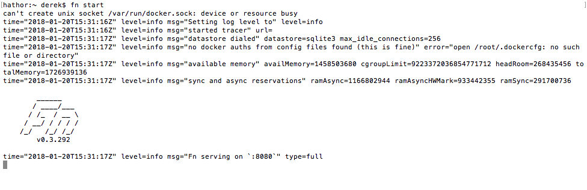

- You should see the Fn logo printed to the console, as well as a message indicating the port that the Fn Server is using: `Fn serving on ':8080'`. From a browser, navigate to **[http://localhost:8080](http://localhost:8080)**, substituting the port listed in the log message for 8080 if it differs. You should see a 'hello world' message in your browser, confirming that the Fn Server is up and running.

  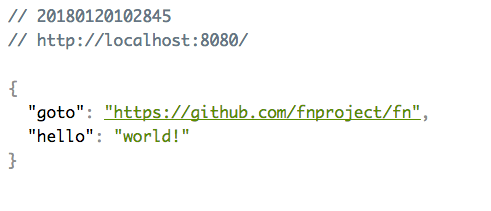

### **STEP 2**: Clone the Function Repository

- Now we're ready to get a copy of the image resizing function and test it out on our local Fn Server. From a new **terminal window**, clone the Git repository into your home directory using the following command. If you choose to clone the repository into a different directory, modify the command in **STEP 8** to reflect your choice.

```bash
cd ~ && git clone https://github.com/derekoneil/image-resize.git && cd image-resize
```

  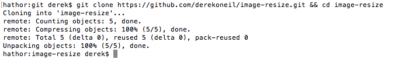

**NOTE**: Functions deployed to Fn are packaged in Docker containers. You can use any programming language to write your functions, and you can deploy them to any Fn Server -- local, running on your server, or hosted in the cloud. The function you just cloned actually involves no code at all, it is simply a Dockerfile that installs and executes the open source command line tool ImageMagick. Using functions like this is a quick and easy way to convert open source or command line tools to auto-scaling web services.

### **STEP 3**: Deploy the Function Locally

- Now that you have the function 'code', you can deploy it to the local Fn Server you started earlier by running the following command in your terminal window:

  `fn deploy --app imgconvert --local`

**NOTE**: The `--app imgconvert` tells Fn to create a new application named imgconvert and associate this function with it. In general, the application can be named anything you like, but by default the name will show up in the function URL. Since the product catalog application is expecting the app to be named `imgconvert`, don't alter the name.

  

### **STEP 4**: Test the Function Using curl

- With the function deployed to our local Fn Server, we can use **curl** to test it. Execute the following command while still in the image-resize directory in your terminal window:

`curl -X POST --data-binary @"sample-image.jpg" -H "Content-Type: application/octet-stream" http://localhost:8080/r/imgconvert/resize128 > thumbnail.jpg`

  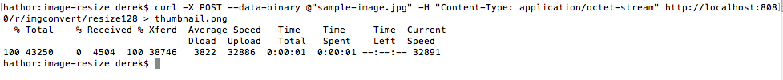

- Open both the **original and resized images** using one of the following commands to verify that the function did it's job -- which is to resize the image to 128px x 128px.

  - Git Bash: `start sample-image.jpg && start thumbnail.jpg`
  - Windows Command Prompt: `sample-image.jpg && thumbnail.jpg`
  - macOS: `open sample-image.jpg && open thumbnail.jpg`
  - Linux (using Image Viewer): `eog sample-image.jpg & eog thumbnail.jpg &`
  - Linux (if ImageMagick is installed): `display sample-image.jpg && display thumbnail.jpg`

**NOTE**: You can also use your OS's file explorer to open the images if the above commands don't work.

  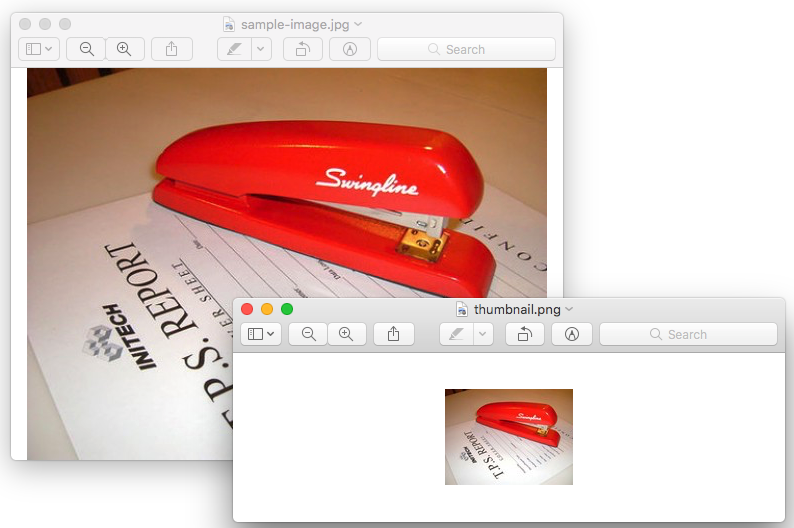

- Now that we've tested our function locally, it's time to set up a remote Fn Server on Kubernetes and deploy our function to the cloud.

## Deploy Your Function to Fn on Kubernetes

### **STEP 5**: Install Helm on Your Local Machine

- Helm is a package manager for Kubernetes that streamlines installing and managing applications on your Kubernetes cluster. We'll use Helm in this lab to install Fn on our cluster. **Download** the latest release for your operating system from the [Helm releases page](https://github.com/kubernetes/helm/releases/latest) in the **Installation and Upgrading** section.

  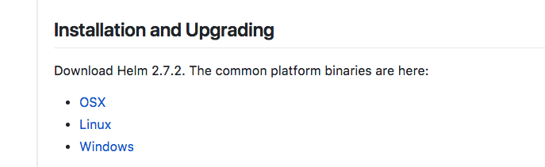

  **NOTE**: See the [Fn Helm GitHub page](https://github.com/fnproject/fn-helm#prerequisites) for more details.

- Open a **terminal window** and run the following commands to extract and initialize **Helm**, ***but first***, **replace ~/Downloads** with the directory where you download the Helm archive in the previous step, and **replace helm-v2.7.2-linux-amd64.tar.gz** with the name of the file you downloaded.

  **NOTE**: `kubectl` needs to be in your PATH for Helm to run. A good test to see if kubectl is in your path is to type: `which kubectl`. If you did not modify your system PATH when you installed kubectl in lab 200, you can run `export PATH=$PATH:/the/directory/where/you/downloaded/kubectl` to alter the path in this shell. Do this before running `helm init` below.

  ```bash
  cd ~/terraform-kubernetes-installer
  export KUBECONFIG=`pwd`/generated/kubeconfig
  cd ~/Downloads
  mkdir helm
  tar -xf helm-v2.7.2-linux-amd64.tar.gz -C helm
  cd helm/*
  ./helm init --upgrade
  ```

  

### **STEP 6**: Deploy Fn Server to Kubernetes Using Helm

- Clone the **fn-helm git repository** using the following command.

  `git clone https://github.com/fnproject/fn-helm.git && cd fn-helm`

  

- Retrieve the correct version of the Helm chart by running the following command:

  `git checkout 4e4988`

- Specify the version of Fn we want to install by modifying the `values.yaml` file using this command:

  `sed -i.bak 's/fnproject\/fnserver:latest/fnproject\/fnserver:0.3.327/' fn/values.yaml`

- Prepare the **dependencies** of the Fn chart by running:

  `../helm dep build fn`

  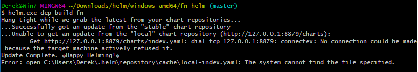

- By default, the server-side component of Helm (Tiller) does not have permissions to perform actions in the `default` namespace. Create a Service Account and bind to the Cluster Admin role to allow Tiller access. **NOTE**: In a production environment, you would want to restrict Tiller to a more limited role than Cluster Admin.

  ```bash
  kubectl create serviceaccount --namespace kube-system tiller
  kubectl create clusterrolebinding tiller-cluster-rule --clusterrole=cluster-admin --serviceaccount=kube-system:tiller
  kubectl patch deploy --namespace kube-system tiller-deploy -p '{"spec":{"template":{"spec":{"serviceAccount":"tiller"}}}}'      
  helm init --service-account tiller --upgrade
  ```

- Install the **Fn chart** by running the following command. **NOTE** _DO NOT_ change the name of the release, `my-release`. This name becomes part of the Kubernetes service name, which is used for DNS routing. If the name is changed, the product catalog application will not be able to communicate with the deployed function.

  `../helm install --name my-release fn`

  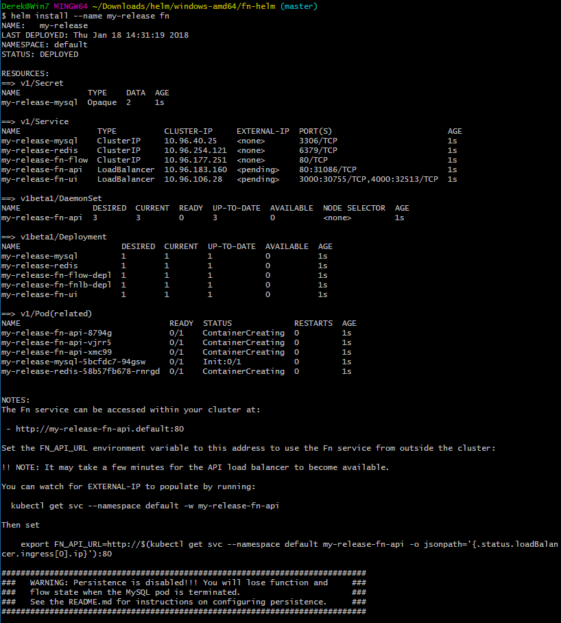

- As directed by the output of the install command, set the `FN_API_URL` environment variable by waiting for the load balancer to be provisioned and using its external IP address in the URL.

  - To check the status of the load balancer from the command line, run the following command. Note, you can use Ctrl-C to stop the command running, and re-run to again check if the External-IP field is populated:

    `kubectl get svc --namespace default -w my-release-fn-api`

    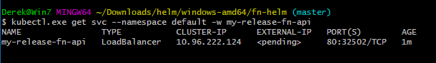

  - Once the **External-IP** field is populated (which could take up to 5 minutes), set the **FN_API_URL** environment variable using the following command:

    ```bash
    export FN_API_URL=http://$(kubectl get svc --namespace default my-release-fn-api -o jsonpath='{.status.loadBalancer.ingress[0].ip}'):80
    ```

    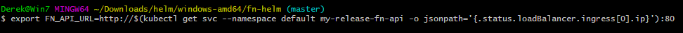

    **NOTE**: You can also find out the API URL from the [Kubernetes dashboard](). To check the status of the load balancer from the [Kubernetes dashboard](), click **Services** from the left side navigation menu and look at the **External endpoints** column of the **my-release-fn-api** service.   

    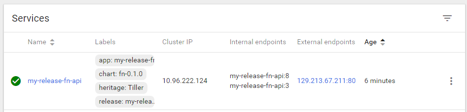

  - Verify that the environment variable was set correctly by running the following command. Note that your IP address will differ from the screenshot.

    `echo $FN_API_URL`

    

### **STEP 8**: Deploy Your Function to Fn Server on Kubernetes

- In the same **terminal window** from the previous step, change directories to cloned function directory from **STEP 2**.

  `cd ~/image-resize`

  

- Since we are pushing to a remote Fn Server, Fn will use Docker Hub as the container registry. We need to set the FN_REGISTRY environment variable to tell Fn which Docker Hub user to push to. In the following command, **replace "your-docker-hub-registry"** with the name of your Docker Hub registry (not your Docker Hub email address):

  `export FN_REGISTRY=your-docker-hub-registry`

  

- **Deploy the function** (and application) to the remote Fn Server using the same command you used in **STEP 3**, but without the --local flag.

  `fn deploy --app imgconvert`

  

- Test the function using **curl**, but this time using the URL of the remote Fn Server:

  ```bash
  curl -X POST --data-binary @"sample-image.jpg" -H "Content-Type: application/octet-stream" $FN_API_URL/r/imgconvert/resize128 > thumbnail-remote.jpg
  ```

  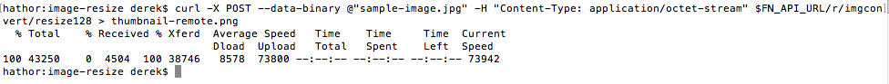

- Open **thumbnail-remote.jpg** (using the same method you used in the local test) to verify the function was successful:

    - Git Bash: `start thumbnail-remote.jpg`
    - Windows Command Prompt: `thumbnail-remote.jpg`
    - macOS: `open thumbnail-remote.jpg`
    - Linux (using Image Viewer): `eog thumbnail-remote.jpg`
    - Linux (if ImageMagick is installed): `display thumbnail-remote.jpg`

  

- Our function is deployed and available on our remote Fn Server, which is running in our Kubernetes cluster. The last thing to verify is that the product catalog application is able to find and use our function. Let's test out the upload image feature.

### **STEP 9**: Test Your Function in the Product Catalog

- Open the **product catalog** website in a browser. If you don't have the URL, you can look in the Kubernetes dashboard for the **external endpoint** of the product-catalog-service, or you can run the following command from your terminal window:

  ```bash
  echo http://$(kubectl get svc --namespace default product-catalog-service -o jsonpath='{.status.loadBalancer.ingress[0].ip}'):$(kubectl get svc --namespace default product-catalog-service -o jsonpath='{.spec.ports[0].port}')
  ```

  

- Click any of the **product images** to open the detail view.

  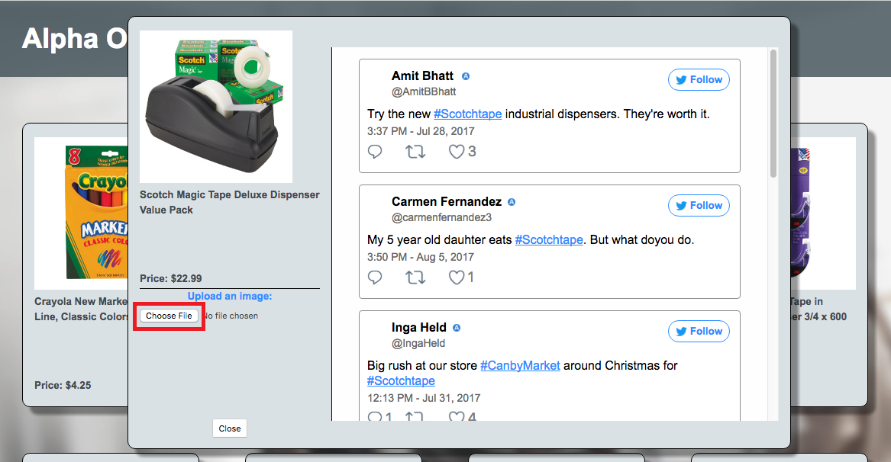

- In the **Upload an image** pane, click **Choose file**. Select an image (the sample image or any other) and click **open**.

  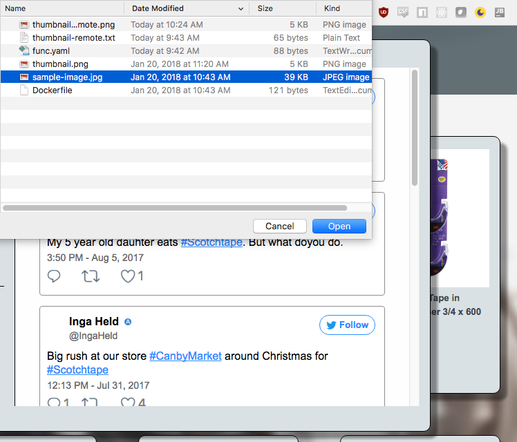

- You'll see a loading spinner in the upload pane while your browser uploads the full size image to the product catalog server. The product catalog server invokes your function (resolved using Kubernetes DNS service at the URL `http://my-release-fn-api/r/imgconvert/resize128`). The thumbnail is returned to the product catalog server, which passes it back to your browser to be displayed. If everything worked correctly, you'll see the generated thumbnail displayed in the upload pane.

  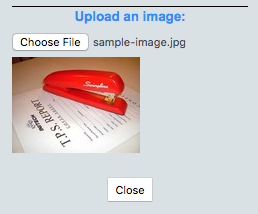

- Congratulations! You've just used the Fn Project to create and deploy a new serverless function to extend your application!

**You have completed the Container Native Application Development Workshop**
