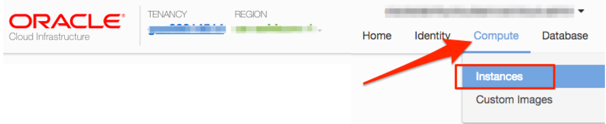
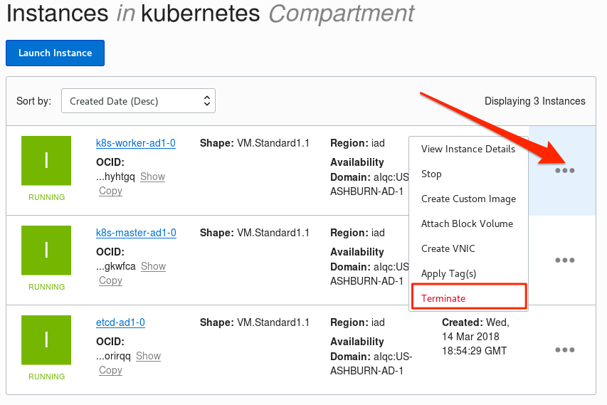
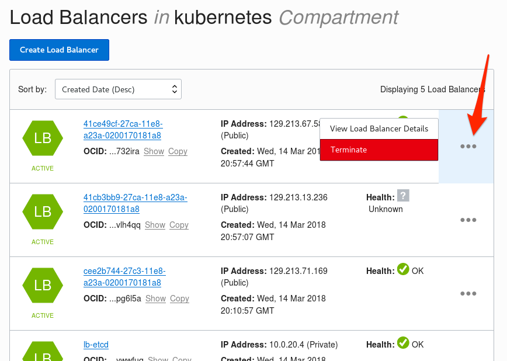
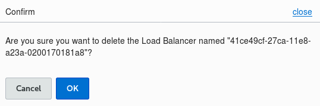
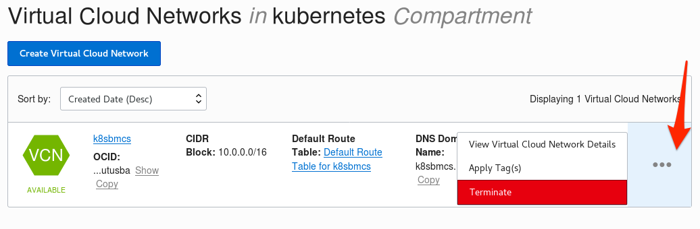
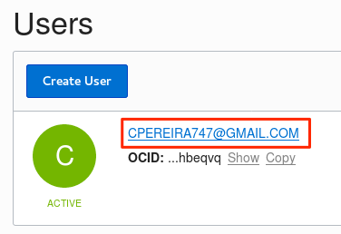
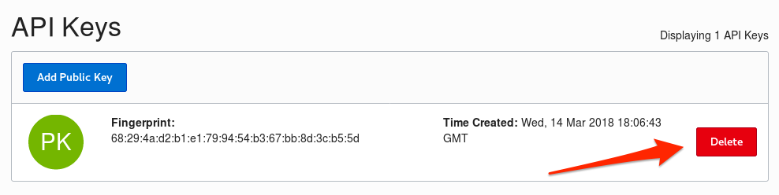

# Cleaning Up After the Workshop

## Introduction

Now that you have completed the workshop, you may want to remove the artifacts left behind in your Oracle Cloud trial account. This guide will show you how to remove everything that you created during the workshop. Note that compute instances and load balancers left running in your Oracle Cloud trial account will continue to consume trial credits until they are terminated.

**_To log issues_**, click here to go to the [GitHub oracle](https://github.com/oracle/learning-library/issues/new) repository issue submission form.

# Remove All Deployed and Installed Workshop Components

## Clean up Oracle Cloud Account

### **STEP 1**: Delete Instances

- As documented in the other labs, connect into your Oracle Cloud Account, and go to the Cloud Console.
- From the Cloud Console, select **Compute > Images** from the top menu option

  

- We will now delete the three instances created by the Workshop. Delete each of the following three images by clicking in the **three dots** to the right of the image, then select **Terminate**

  

- Ensure the **Permanently delete** box is checked, and click on **Terminate Instance**.

  

- Repeat the previous steps to delete the other two instances, and wait until the instances show **Terminated**.

### **STEP 2**: Delete Load Balancers

  

- From the top menu bar, click on **Networking > Load Balancers**

  

- Click on the **three dots** next to the First load balancer in the list, and click on **Terminate**

  

- Click on **OK**

  

- **Repeat the steps** for the remaining Load Balancers until all used by the workshop have been removed.

  

### **STEP 3**: Delete the Virtual Network

- Using the top menu bar, go to **Networking > Virtual Cloud Networks**.

  

- Click on the **Three Dots** to the right of the Virtual Cloud Network, and click on **Terminate**.

  

### **STEP 4**: Delete the API Key Fingerprint

- Using the top menu bar, go to **Identity > Users**.

  

- Click on the **User's Name**.

  

- From the **API Key** section, click on the **Delete** button to the right of the **Fingerprint** you created during this workshop. Confirm the delete by clicking on **OK** in the popup dialog box.

  
